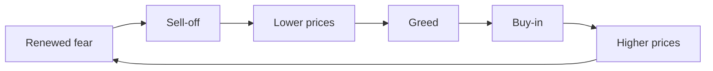
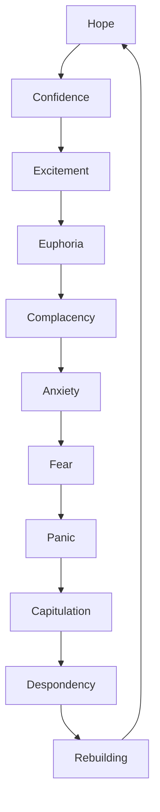
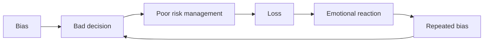

# BEHAVIORAL_FINANCE

## Төслийн зорилго
Энэ баримт бичиг нь Behavioral Finance буюу зах зээлийн хүний зан төлөвийн шинжлэх ухааныг эхлэгчдэд ойлгомжтой монгол хэлээр тайлбарлана. Энэхүү курс нь психолоогийн нөлөө, cognitive bias, FOMO, narrative bias, mental accounting зэрэг ойлголтыг анализ, практиктай холбож, зах зээлийн өгөгдлөөс гадна хүний сэтгэл хөдлөл ямар үүрэгтэйг харуулна.

---

## What behavioral finance is and why human psychology affects markets
Behavioral Finance гэдэг нь зах зээл дэх хүмүүсийн шийдвэр, мэдрэмж, талдлах үйл явц нь үнэ хөдөлгөөнт хэрхэн нөлөөлж байгааг судалдаг салбар юм.

- Зах зээл бол зөвхөн математик биш. Энэ нь хүний айдас, шунал, хүлээлт, журамт бус хандлагаас бүрдэнэ.
- Хүмүүс гэдэг нь логик, мэдрэмж, нөхцөл байдлын аль альнаар шийдвэр гаргадаг. Тиймээс market behavior нь бодит санаа, биш харин үнийн хариу үйлдэлтэй илүү холбоотой.

Зах зээлд psychology нөлөөлж байгаагийн шалтгаан:
- Арилжаачид хязгаарлагдмал мэдээлэлтэй, эрсдэлтэй нөхцөлд шийдвэр гаргадаг.
- Мэдээлэл найдвартай биш, бид бусдын үйлдлийг харж дүгнэдэг.
- Хүмүүс тухайн мөчид стресс, эмзэг, шуналтай тул логик байдлаар хандах нь ховор.

---

## Гол ойлголтууд

### Behavioral Finance
- Дуудлага: *бихейвиорал файнанс*
- Үндэс: "behavioral"=пайнарал, "finance"=санхүү
- Монгол утга: хүний зан төлөвт суурилсан санхүүгийн шинжлэх ухаан
- Энгийн тайлбар: Зах зээл дээр хүмүүс яагаад логик бус, мэдрэмжээр шийдвэр гаргадагийг судалдаг салбар.

Behavioral Finance нь классик санхүүгээс ялгаатай. Классик санхүү нь хүмүүс хэзээ ч бүрэн рационал гэж үздэг бол behavioral finance нь бидний шийдвэрүүдэд cognitive bias, emotions, social pressure нөлөөлдөг гэдгийг хүлээн зөвшөөрдөг.

---

### Cognitive Bias
- Дуудлага: *когнитив байас*
- Үндэс: "cognitive"=ойлгох, "bias"=тэгш бус байдал
- Монгол утга: танин мэдэхүйн татах хандлага
- Энгийн тайлбар: Ойлголт, дүгнэлт хийхдээ бидний тархи өөрт илүүд үзсэн үр дүнд алхдаг явдал.

Cognitive bias нь мэдрэмж, мэдлэг, туршлагаас үүдсэн бодит бус шалгуур. Зах зээлд энэ нь буруу таамаг, хэт их найдвартай эсвэл хэт их эмзэг байх зэрэгт хүргэдэг.

---

### Loss Aversion
- Дуудлага: *лосс аверсн*
- Үндэс: "loss"=алдагдал, "aversion"=дургуйцэл
- Монгол утга: алдагдалд илүү эмзэг хандах
- Энгийн тайлбар: Тэдний хувьд 1 төгрөг алдах өвдөлт 1 төгрөг олох аз жаргалтай тэнцдэггүй.

Loss aversion нь трейдерүүдэд deep stop-loss-ыг олоход туслахгүй, эсвэл ашигтай байрлалыг хэт хурдан хаах шалтгаан болдог.

---

### Confirmation Bias
- Дуудлага: *конфермейшн байас*
- Үндэс: "confirmation"=баталгаажуулалт, "bias"=тэгш бус байдал
- Монгол утга: өөрийн бодлыг батлахыг эрмэлзэх хандлага
- Энгийн тайлбар: Өөрийн тайлбарлах үзэлтэй нийцсэн мэдээллийг хайж, бусдыг үл тоох.

This bias makes traders look only for evidence that supports their trade idea and ignore warning signs.

---

### Herd Mentality
- Дуудлага: *херд менталити*
- Үндэс: "herd"=элч, бүлэг, "mentality"=сэтгэлгээ
- Монгол утга: олны дагасан сэтгэлгээ
- Энгийн тайлбар: Бусдын хийж буйг дагаж, өөрөөрөө дүгнэлтгүйгээр мөнгийг хөдөлгөх.

Crowds create momentum, and institutional traders often use that momentum against retail participants.

---

### Anchoring Bias
- Дуудлага: *анкеринг байас*
- Үндэс: "anchor"=усан онгоцны үүргэвч, "bias"=тэгш бус байдал
- Монгол утга: анхны үнэ, байрлал эсвэл мэдээлэлдээ баригдаж байх хандлага
- Энгийн тайлбар: Тухайн эхний оноог буруу гэж бодсон ч тархи түүнд баригдсаар шинэ өгөгдлийг зөв шүүнэ.

Traders anchor on an entry price, a round number, or a previous high/low and fail to adapt to new evidence.

---

### Recency Bias
- Дуудлага: *рисенси байас*
- Үндэс: "recent"=саяны, "bias"=тэгш бус байдал
- Монгол утга: хамгийн сүүлчийн туршлага, үнэ хөдөлгөөнд илүү итгэх хандлага
- Энгийн тайлбар: Сүүлийн 1-2 өдөр эсвэл долоо хоногт юу болсон гэдэг нь бүхнийг шийднэ гэж бодох.

This bias causes traders to overweight recent volatility and ignore longer-term context.

---

### Emotional Decision
- Дуудлага: *эмоушнал дисижн*
- Үндэс: "emotional"=сэтгэл хөдлөлтэй, "decision"=шийдвэр
- Монгол утга: мэдрэмж дээр суурилсан шийдвэр
- Энгийн тайлбар: Баримт, дүрэмээс илүү айдас, шунал эсвэл FOMO-оор хийгдсэн үйлдэл.

Emotional decisions are often fast, reactive, and divorced from risk management.

---

### Irrational Behavior
- Дуудлага: *иррэйшнл бихэйвиор*
- Үндэс: "irrational"=логикгүй, "behavior"=захирал
- Монгол утга: логикгүй үйлдэл
- Энгийн тайлбар: Үнийн хөдөлгөөн, магадлалдаа нийцэхгүйгээр хийсэн шийдвэр.

Irrational behavior is the norm in markets, not the exception, especially when emotions run high.

---

### Fear and Greed
- Дуудлага: *фиар энд грид*
- Үндэс: "fear"=айдас, "greed"=шунал
- Монгол утга: айдас ба шунал
- Энгийн тайлбар: Хүмүүс үнэ унах гэж айж эсвэл өсөх гэж шунан оролцдог хоёр эгшиг.

Зах зээлийн ихэнх мөчлөг нь энэ хоёр мэдрэмжийн хооронд эргэлддэг.

---

### Overconfidence
- Дуудлага: *овэрконфиденс*
- Үндэс: "over"=дээр, "confidence"=итгэл
- Монгол утга: хэт их итгэл
- Энгийн тайлбар: Бүх үзүүлэлт, нөхцөл байдлыг өөрөө сайн ойлгож байна гэж бодох.

Overconfidence leads traders to overtrade, use too much leverage, and underestimate risk.

---

### FOMO
- Дуудлага: *фомо*
- Үндэс: “Fear Of Missing Out” = хоцрох айдас
- Монгол утга: алдах айдас
- Энгийн тайлбар: Бусдын ашигт орох гэж яарч орох мэдрэмж.

FOMO drives many retail traders into late entries and bad timing.

---

### Narrative Bias
- Дуудлага: *нэрэйтив байас*
- Үндэс: "narrative"=өгүүллэг, "bias"=тэгш бус байдал
- Монгол утга: өгүүлэмжээр явах хандлага
- Энгийн тайлбар: Зах зээл влог, мэдээ, шалтгааны түүхээр хаашаа хөдөлнө гэж найдаж байгаагаа хэлнэ.

Narrative bias makes traders believe a story more than the data.

---

### Mental Accounting
- Дуудлага: *мэнтл аккаунтинг*
- Үндэс: "mental"=сэтгэлзүйн, "accounting"=нягтлан бодох
- Монгол утга: сэтгэхүйн маягаар хөрөнгийг ангилах
- Энгийн тайлбар: Мөнгөө өөр өөр "хэвшил", "хаалт" тавьж боддог, нэгтгэж үздэггүй.

Mental accounting causes people to treat winnings differently from savings, even though бүх мөнгө адилхан үнэ цэнэтэй.

---

### Prospect Theory
- Дуудлага: *проспект тийори*
- Үндэс: "prospect"=хүлээлт, "theory"=онол
- Монгол утга: хүлээлтийн онол
- Энгийн тайлбар: Алдагдалд илүү эмзэг хандаж, ашиг олж байгаа үед бодит бус бага сэтгэл ханамж авах.

Prospect Theory describes how people value gains and losses asymmetrically. Энэ нь зах зээлийн volatility-д хүмүүст хэрхэн хариу үйлдэл үзүүлэхийг тайлбарладаг.

---

## Why humans are not fully rational
- Хүний тархи нь бүх мэдээллийг нэгэн зэрэг боловсруулахгүй.
- Стресс, яарсан шийдвэр, өрсөлдөөн, хэт мэдрэмж нь логикийг бууруулна.
- Бид олон тохиолдолд таамаг, дүрэм, intuition дээр тулгуурлана.
- Зах зээлд мэдээлэл бүрэн бус, ирээдүйг тодорхой хэлэх боломжгүй.
- Cognitive bias нь бидний ой тогтоолт, анхаарал, ангилалт, дүгнэлт хийх чадварыг өөрчилдөг.

Энэ шалтгаанаас зах зээлд хамгийн сайн арилжаачид ч 100% рационал биш, харин тогтсон дүрэмтэй, өөрсдийн bias-ээ мэддэг хүмүүс байдаг.

---

## Why emotions overpower logic in markets
- Зах зээл бол динамик, шууд тохирохгүй нөхцөл юм.
- Хүн сандрах үед логик тархиныгээ орхиж, уурлах, айх, шуналлах хэсэг идэвхждэг.
- Алдагдалтай байрлалд ирэхэд тархи "аюулгүй" гэсэн дохио авдаг, хүчтэй айдас үүсдэг.
- Ашигтай байрлал өндөр болсноор шунал нэмэгдэж, амжилтын мэдрэмжид автдаг.
- Бидний тархи short-term pain болон pleasure-д илүү чухал ач холбогдол өгдөг.

Энэ нь market structure, signal, статистик боловсруулсан гурван логикыг орхиж, тайван шийдвэр хийх чадварыг гажуудуулдаг.

---

## How crowds create bubbles
- Crowd mentalitet нь one-way thinking үүсгэдэг.
- Нэг хөрөнгө өсөхөд хүмүүс илүү их орж, үнэ нэмэгдэж, улам их хүний FOMO-ыг хөдөлгөдөг.
- Overconfidence ба narrative bias нь "энэ удаа өөр" гэсэн итгэлийг нэмэгдүүлдэг.
- Mental accounting нь хүмүүсийг "энэ орлого" гэж тусад нь бодож, эрсдэлийг үл ойшоодог.
- Энэ бүхний үр дүнд үнэ зүгээр нэг өсөх бус, bubble буюу давхарга үүсдэг.

Bubble нь тогтмол логик биш. Энэ нь хүмүүсийн collective belief, not fundamentals, дээр үүсдэг.

---

## Why panic spreads quickly
- Айдас нь contagion шиг ажиллана: хэн нэг шуугианд хамгийн түрүүнд орж, бусдыг дараалан дагана.
- Social media, мэдээ, charts хурдан тарж, хүмүүс нэг нэгэндээ "сүүлийн үеийн" мэдээлэл дамжуулна.
- Алдагдалд орсон хүний тархи бага дутагдлыг илүү хүчтэй мэдэрнэ. Тиймээс зарим нь шууд зарах хүсэлд автаад crowd-ыг өргөжүүлдэг.
- Market liquidity багассан үед жижиг шок том хөдөлгөөн болж хувирна.
- Энэ бол feedback loop: үнэ унаж, айдас нэмэгдэж, дахин үнэ унаж.

---

## Why traders repeat the same mistakes
- Confirmation bias: өмнөх үйлдлийг батална.
- Overconfidence: амжилтаа skill гэж үзнэ.
- Mental accounting: алдагдлыг тусад нь, ашгийг тусад нь бодно.
- Lack of journaling: алдаагаа бичиж тэмдэглэдэггүй.
- Emotional decision: асуудлыг үнэлэлгүйгээр FOMO, revenge trading, panic selling хийдэг.

Ямар ч боловсролтой хүн давтагдсан алдаанаас суралцахгүй бол мөн өөрийгөө давтаж буруу шийдвэр гаргадаг.

---

## Social media influence on financial behavior
- Social media бол narrative, FOMO, overconfidence, confirmation bias-ыг түргэсгэх хамгийн хүчтэй хэрэгсэл.
- Салбар дахь influencers, trading group-ууд, charts болон hashtags нь crowd psychology-г шууд хөдөлгөдөг.
- Сонирхогч олон байхад "all-time high" болон "must-buy" өгүүлэмжүүд маш хурдан тардаг.
- Энэ нь амжилттай арилжааны системээс илүү их hype-д тулгуурласан market moves үүсгэнэ.

Social media нь зөв мэдээлэл өгдөг ч, олонхи нь sensational content, half-truths, болон confirmation bias-ыг нэмэгдүүлдэг.

---

## Why intelligent people still make emotional mistakes
- Их оюун ухаан нь логик чадвартай, гэхдээ мэдрэмжийн хяналтгүй байж болно.
- Intelligence нь bias-ээс хамгаалдаггүй, харин уур, FOMO, social pressure нь хэн бүхний тархинд нөлөөлдөг.
- Өндөр IQ-тэй хүмүүс ч overconfidence, narrative bias, anchoring ба recency bias-д автах боломжтой.
- Зөвхөн мэдээлэлтэй байснаар хангалтгүй; хэрхэн сэтгэлээ удирдах, decision process-оо зохион байгуулах нь чухал.

Илүү боловсролтой байх нь emotional mistakes-ээс дэлхийг салгахгүй. Харин self-awareness, discipline, rule-based system нь салгана.

---

## Difference between logical thinking and emotional reaction
- Logical thinking:
  - Үр дүнг урьдчилан тооцдог.
  - Дүрэм, risk management, evidence ашиглана.
  - Магадлал, edge, expectation дээр суурилна.
  - Long-term шууд байдалд төвлөрнө.

- Emotional reaction:
  - Түргэн, завсардмал, стрессээр дүүрэн.
  - FOMO, panic, revenge trading, confirmation bias-т суурилна.
  - Single trade-аас эмээх эсвэл шунан хэт итгэх.
  - Short-term мэдрэмж дээр чиглэнэ.

Logical thinking нь зах зээлийн системтэй, emotional reaction нь market noise-т илүү өртдөг.

---

## Tables

### Rational behavior vs emotional behavior

| Rational behavior | Emotional behavior |
|---|---|
| Дүрэмтэй арилжаа хийх | FOMO дээр тулгуурлан оролцох |
| Risk management ашиглах | Stop loss-гүй эсвэл very tight stop ашиглах |
| Data дээр тулгуурлан шийдвэр гаргах | Давхар өгүүлэмж, rumor дагах |
| Long-term expectation-ийг харж ажиллах | Өнөөдрийн үнэ өсөхгүй бол шууд алдагдалд гаргах |
| Алдагдлыг зөвөөр хүлээн авах | Алдагдлыг нөхөх гэж revenge trading хийх |

---

### Professional thinking vs crowd thinking

| Professional thinking | Crowd thinking |
|---|---|
| Probability, edge, expectancy-ийг судална | "Энэ удаа өөр" гэж бодно |
| Capital preservation-first | Амжилтын мэдрэмжийн дагуу ажиллана |
| Journal, review, process | Social media, rumor, hype-д итгэнэ |
| Structural context-ыг харна | Алдагдал болон ашигтай график дээрх сүүлчийн хөдөлгөөнд анхаарна |
| Emotion control-д ажиллана | Айдас, шунал, FOMO-д амархан автана |

---

### Healthy risk thinking vs emotional risk taking

| Healthy risk thinking | Emotional risk taking |
|---|---|
| Зөв тооцсон, жижиг байрлал | Тархиа мэдүүлээгүй, том байрлал |
| Stop loss тодорхой | Stop loss-ийн талаар боддоггүй эсвэл хэт ойр байрлуулна |
| Дүрэмт хувилбартай | Хүсэл, айдас дээр тулгуурлана |
| Diminishing exposure during stress | Дахин орж алдагдлаа нөхөх гэж exposure-ыг нэмэгдүүлнэ |
| Long-term capital preservation | Тусдаа ганц trade-ийг амжилттай болгох гэж оролдоно |

---

## Diagrams

### Fear and greed cycle

### Emotional market cycle

### Bias → bad decision → loss cycle

---

## Practical exercises

### Emotional awareness exercise
- Өдөр бүр арилжаагаа хийхээс өмнө 3 минут өөрийн сэтгэл мэдрэмжийг ажигла.
- "Өнөөдөр айдас байна уу? Шунал байна уу? FOMO байна уу?" гэж асуу.
- Энэ өгүүлбэрүүдийг тэмдэглэ: "Миний шийдвэр логик эсвэл мэдрэмж дээр суурилж байна.".

### Bias identification checklist
- Өдөр бүр доорх bias-үүдээс аль нь байгааг шалга:
  - Confirmation bias
  - Anchoring bias
  - Recency bias
  - Overconfidence
  - FOMO
  - Narrative bias
- Хэрвээ аль нэг нь байвал яагаад, ямар ямар өгөгдлийг мартаж байгаагаа бич.

### Daily behavior observation journal
- Өнөөдрийн хамгийн том арилжааны шийдвэрээ бич.
- Ямар мэдрэмжээр шийдсэн бэ?
- Энэ шийдвэр логик уу, emotional уу?
- Хэрвээ би одоо дахин хийх бол юуг өөр өөрөөр хийх вэ?
- Энэ арилжаанд ямар bias нөлөөлсөн бэ?

### Crowd psychology observation exercise
- Социал медиа болон мэдээний эх үүсвэрүүдэд анхаарал тавь.
- Хүмүүс ямар өгүүлэмж их хэрэглэж байна вэ? ("all-time high", "must-buy", "sell everything")
- Энэ хөдөлгөөнийг bubble, momentum эсвэл correction гэж харж болох уу?
- Өөрийн ажиглалт ба зах зээлийн real price action-ыг харьцуул.

---

## How professionals reduce emotional bias
- Тэд системтэй дүрэмтэй ажилладаг: entry, stop, target, risk per trade.
- Журнал бичдэг, алдаа, давталтыг тэмдэглэдэг.
- Emotional state-ээ өдөр бүр шалгадаг.
- Position sizing-ыг нарийн тооцож, leverage-ийг хянадаг.
- Long-term probability, expectancy, edge дээр төвлөрдөг.
- Social media hype-гаас бага хамаардаг, тухайн trade-ийг өөрөө системээрээ үнэлдэг.
- Хэрвээ сэтгэл сэргээгүй бол арилжаа хийхгүй.

Эдгээр нь market psychology-г ашигтай тал руу эргүүлэх хамгийн үр дүнтэй арга.

---

## Why self-awareness is a financial advantage
- Өөрийгөө таних нь таны хамгийн хүчтэй хөрөнгө.
- Та bias-ээ хянаж, илүү зөв шийдвэр гаргаж чадна.
- Self-awareness нь discipline-ийг сайжруулж, revenge trading-ийг бууруулна.
- Энэ нь таны trading system-ийг зөвшөөрөхгүй, харин сайжруулахад тусална.
- Амжилттай арилжаан дахь агуу ялгаа нь IQ биш, EQ болон self-control байж болно.

Мөнгөний зах зээлд таны хамгийн эхний давуу тал бол өөрийнхөө мэдрэмж, хандлага, bias-ийг ойлгох чадвар.

---

## The market often tests human psychology more than intelligence
Зах зээл тухайлбал IQ-г шалгадаггүй. Энэ нь таны хэн болох, хэр түргэн сэтгэл хөдлөлөө хянаж, шунал, айдас, FOMO, confirmation bias-г хэн сайн даван гарч байгааг шалгадаг.

- Зах зээл хүнд даалгавар өгдөг: "Та энэ үед юуг хийх вэ?" гэдгийг шалгана.
- Хэн нэг бодит утгатай мэдээллээс илүүтэй, хөрөнгө оруулагчийн сэтгэл хөдлөл, collective behavior-г туршдаг.
- Илтгэлийнэд хувь хүний ухаалаг байдал жижиг бөгөөд, decision process болон психологийн удирдлага их илүү чухал.

Энэ учраас мэргэжилтэн арилжаачид IQ-ээс илүүтэй өөрийн мэдрэмж, дүрэм, сэтгэл хөдлөлийг удирдах чадварт илүү их анхаардаг.
