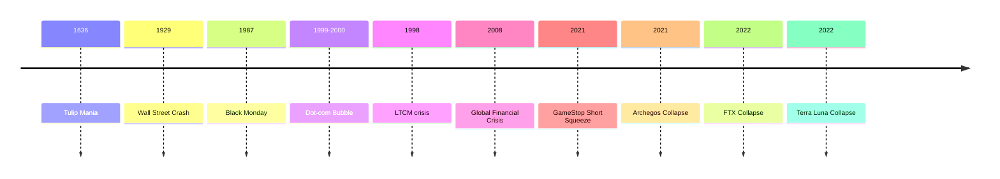

# HISTORICAL_DISASTERS

## Төслийн зорилго
Энэхүү баримт бичиг нь зах зээлийн том хямралуудыг (historical market disasters) боловсролын зорилгоор судлахад зориулагдсан. PROJECT_CORE.md, MARKET_PSYCHOLOGY.md, LIQUIDITY.md, PENNY_STOCKS.md-тай нийцүүлэх бөгөөд эхлэгчдэд зориулсан энгийн, аналитик тайлбар, сургамжийг товч өгнө.

---

## Яагаад түүхэн зах зээлийн гамшиг судлах нь чухал вэ?
- Тэд давтагддаг хошуу дүр зургаас сургамж өгдөг: хүний сэтгэл зүй, leverage, liquidity, институцийн алдаанууд зэрэг нөлөөлдөг.
- Мэргэжилтнүүдийн шийдвэр, зохицуулалтын өөрчлөлт, системийн эмзэг цэгүүдийг ойлгох боломж өгдөг.
- Эхлэгчдэд "Risk first" зарчмыг хэрхэн хэрэгжүүлэх, дохиог яаж уншихыг заадаг.

---

## Гол ойлголтууд (definitions)
(Бүх терминд: pronunciation, root, Mongolian meaning, simple explanation)

### Bubble
- Дуудлага: *бабл*
- Үндэс: англи "bubble" = атираа, бөмбөлөг
- Монгол утга: үнэ бодит өртгөөс хэт өндөр дээдэлсэн дүр зураг
- Энгийн тайлбар: Бодит үнэ, ашигтай үндэслэлгүйгээр үнэ хурдан өсч, дараа нь унадаг.

### Systemic Risk
- Дуудлага: *системик риск*
- Үндэс: "systemic"=системтэй холбоотой, "risk"=эрсдэл
- Монгол утга: системийн бүхэлд нөлөөлөх эрсдэл
- Энгийн тайлбар: Нэг байгууллага унаснаар систем даяар асуудал үүсэх боломж.

### Contagion
- Дуудлага: *контейжн*
- Үндэс: латин "contagion" = халдах
- Монгол утга: нэг салбар эсвэл байгууллагаас нөгөө рүү асуудал дамжих үйлчлэл
- Энгийн тайлбар: Зах зээлүүд бие биенээс хамааралтай тул нэг газар асуудал тархдаг.

### Leverage
- Дуудлага: *левередж*
- Үндэс: англи "lever" = өргөгч, хүч
- Монгол утга: зээл ашиглаж байрлал томсгож ашиг хүлээх арга
- Энгийн тайлбар: Бага капиталтай илүү том байрлал авах, гэхдээ алдагдал томсдог.

### Margin Call
- Дуудлага: *марджин кол*
- Үндэс: "margin" = марк, "call" = дуудлага
- Монгол утга: брокераас хөрөнгө нэмэх эсвэл байрлалыг бууруулах шаардлага ирэх тохиолдол
- Энгийн тайлбар: Зээлээр барьсан байрлал алдагдалд орвол брокер нэмэлт мөнгө шаарддаг.

### Forced Liquidation
- Дуудлага: *форсд ликвидашн*
- Үндэс: "forced" = хүчээр, "liquidation" = арилжаа хаах
- Монгол утга: брокер эсвэл системийн шаардлагаар байрлал хүчээр хаагдах
- Энгийн тайлбар: Брокер таныг алдагдал их болсны дараа хүчээр зарах.

### Short Squeeze
- Дуудлага: *шорт сквиз*
- Үндэс: "short" = богино байрлал, "squeeze" = шахалт
- Монгол утга: богино байрлагсад алдагдлаас хамгаалж хурдан худалдан авахад үүсэх үнэ өсөлт
- Энгийн тайлбар: Богино байрлал өндөр байх үед үнэ өсвөл богино байрлагсад хаалтад шахагдан үнэ улам өсдөг.

### Credit Expansion
- Дуудлага: *кредит экспаншн*
- Үндэс: "credit" = зээл, "expansion" = өргөжих
- Монгол утга: зээлийн хэмжээ ертөнцөд ихсэх үйл явц
- Энгийн тайлбар: Банк, санхүүгийн байгууллагууд зээл их олгож, зах зээлд их мөнгө ордог.

### Financial Panic
- Дуудлага: *файнэншл паник*
- Үндэс: "financial" = санхүүгийн, "panic" = хурц айдас
- Монгол утга: хурдан, өргөн цар хүрээтэй авахгүй гэмшилтт нөхцөл
- Энгийн тайлбар: Хүмүүс хурдан ихийг зарахад зах зээл унадаг болон системийн эмзэг байдал үүсдэг.

---

## Түүхэн кейсүүд
Доорх бүрийн доор: (What happened / Main actors / Psychology / Liquidity issues / Role of leverage / Crowd amplification / Professional lessons / Beginner lessons)

### Tulip Mania (1630s)
- What happened: Голландын тансаглалтай тансаг үзэгдэл—тулупын үнэт цэцгийн үнэ огцом өсч, дараа нь гэнэт унасан.
- Main actors: Голландын худалдаачид, колониал худалдаа, хөрөнгө оруулагчид
- Psychology: FOMO, speculation, social status buying
- Liquidity issues: Газрын зах зээл шиг биш ч зах зээл механизмгүй, үнэмлэхүй шалгаралтгүй хэт их эрэлт байв
- Role of leverage: Бүртгэлтэй барьцаа, forward type contracts-ууд (төгсгөлийнгүй гэрээ)
- Crowd amplification: Нийгмийн статус, түүнд нийцэх хүсэл үнэ өсөлтийг түргэсгэсэн
- Professional lessons: Зах зээлийг зохион байгуулалттай шалгахаас өмнө үнэлж болохгүй
- Beginner lessons: Өгөгдөлгүйгээр үнэмлэхүй өсөлтөд итгэж болохгүй

### 1929 Wall Street Crash
- What happened: 1929 оны аравдугаар сард нэлээд том уналт эхлэж, дэлхийн эдийн засагт гүнзгий уналт авчирсан.
- Main actors: Инвесторид, банкууд, брокерууд, регуляторууд
- Psychology: Overconfidence during the 1920s, margin speculation
- Liquidity issues: Banks, credit tightening, run on banks
- Role of leverage: Margin lending was widespread; leverage amplified losses
- Crowd amplification: Mass selling and panic
- Professional lessons: Importance of regulation, capital buffers, central bank responses
- Beginner lessons: Margin бол өндөр эрсдэл, "pricing"-г бодит үнээр бус хоорондын хамааралтайгаар бүү найдаж

### Black Monday (1987)
- What happened: 1987 оны 10-р сарын 19-нд олон индексууд нэг өдөрт асар хүчтэй унаснаар DJIA ~22.6% унав.
- Main actors: Portfolio insurance programs, program trading, institutional traders
- Psychology: Panic selling, feedback loops from automated strategies
- Liquidity issues: Market depth shrank; bid/ask spread widened
- Role of leverage: Portfolio insurance created dynamic hedging that magnified selling
- Crowd amplification: Automatic programs + human selling reinforced рух
- Professional lessons: Algorithmic risk, liquidity dry-up, need for circuit breakers
- Beginner lessons: Автомат стратегитай зах зээлд илүү болгоомжтой байх; системийн эрсдэлийг ойлго

### Dot-com Bubble (1995–2000)
- What happened: Интернет компаниудын хувьцаануудын үнэтэй өсөлт, ихэнх нь ашигтай бизнес моделгүй; 2000 онд их уналт эхэлсэн.
- Main actors: Tech startups, VCs, retail investors, media
- Psychology: Euphoria, narratives of "new economy"
- Liquidity issues: Many IPOs, but profitable business modelгүй компаниуд ихсэв
- Role of leverage: Margin used by retail and some institutional participants
- Crowd amplification: Media hype, analyst optimism
- Professional lessons: Importance of fundamentals, valuation discipline
- Beginner lessons: Ирээдүйн өсөлт юм гэж хэт итгэхгүй; fundamentals-г шалга

### 2008 Financial Crisis
- What happened: Орон сууцны зах зээлийн пуужин, субпрайм зээл, MBS болон CDS нарыг дампуурахад хүргэж, системийн кризис үүссэн.
- Main actors: Investment banks, commercial banks, rating agencies, regulators
- Psychology: Overconfidence, complacency, assumption of diversification
- Liquidity issues: Interbank market froze, credit lines dried
- Role of leverage: High leverage at investment banks, shadow banking leverage
- Crowd amplification: Credit contraction led to fire sales and further asset price declines
- Professional lessons: Counterparty risk, transparency, capital requirements
- Beginner lessons: Systemic risk нь бүх дансны үнэ цэнэ алдахад нөлөөлдөг; leverage-гаа хяна

### Long-Term Capital Management (LTCM) (1998)
- What happened: Quant hedge fund LTCM, өндөр leverage ашиглан алдаатай байрлал авснаас системтэй эрсдэл үүсэж санхүүгийн зах зээл дэмжлэгтэйгээр аварсан.
- Main actors: LTCM, major banks, Federal Reserve
- Psychology: Overreliance on models, hubris
- Liquidity issues: Market counterparties тохиролцохгүй, liquidity тендергүй боллоо
- Role of leverage: Extremely high leverage (~25:1 – 100:1 in some measures)
- Crowd amplification: Margin calls on counterparties, correlated positions led to market stress
- Professional lessons: Model risk, tail risk, need for stress testing
- Beginner lessons: Математик загварт бүх зүйл ордоггүй, leverage-ыг болгоомжтой ашигла

### Archegos Collapse (2021)
- What happened: Family office Archegos used total return swaps and high leverage to build massive concentrated positions; sudden margin calls led to rapid forced liquidations and multi-billion losses for prime brokers.
- Main actors: Archegos, prime brokers (Credit Suisse, Nomura), counterparties
- Psychology: Excessive confidence, opacity of swap exposures
- Liquidity issues: Forced sales caused sharp moves in underlying stocks; liquidity evaporated for concentrated names
- Role of leverage: Very high leverage via derivatives
- Crowd amplification: Prime brokers unwinding positions contributed to price swings
- Professional lessons: Counterparty exposure transparency, risk limits, margin models
- Beginner lessons: Derivatives can hide leverage; concentrated bets are dangerous

### GameStop Short Squeeze (2021)
- What happened: Retail investors (notably Reddit's WallStreetBets) coordinated buying, causing a short squeeze that forced large hedge funds to cover shorts, producing huge volatility.
- Main actors: Retail traders (Reddit), short sellers (hedge funds), market makers
- Psychology: Collective action, narrative of "squeeze the shorts", FOMO
- Liquidity issues: Short interest high versus float; heavy volatility strained execution and liquidity
- Role of leverage: Some hedge funds used leverage to maintain short positions; forced covering created feedback
- Crowd amplification: Social media coordination amplified buying pressure
- Professional lessons: Short interest monitoring, risk management for naked/large shorts
- Beginner lessons: Market moves can be irrational; avoid all-in bets; short squeezes are unpredictable

### FTX Collapse (2022)
- What happened: Crypto exchange FTX suffered liquidity crisis and insolvency after revelations about misuse of customer funds and risky related-party lending.
- Main actors: FTX, Alameda Research, customers, regulators
- Psychology: Trust in central intermediaries, herd withdrawal
- Liquidity issues: Rapid withdrawals (bank-run-like) drained exchange liquidity
- Role of leverage: Alameda's leveraged bets and inter-company exposure
- Crowd amplification: News, social media, and panic withdrawals
- Professional lessons: Custody risks, need for transparency, regulation
- Beginner lessons: Centralized crypto platforms can fail; custody risk matters

### Terra (Luna) Collapse (2022)
- What happened: Algorithmic stablecoin UST lost its peg, leading to collapse of Luna token and massive losses.
- Main actors: Terraform Labs, Do Kwon, DeFi participants
- Psychology: Blind faith in algorithmic stability, high yields
- Liquidity issues: Liquidity drained as peg lost; market depth insufficient to restore peg
- Role of leverage: Leverage in DeFi positions amplified losses
- Crowd amplification: Panic selling, contagion across crypto
- Professional lessons: Stablecoins need robust design and reserve backing
- Beginner lessons: High yield promises often hide structural risk

---

## Common patterns across market collapses
- Excessive leverage precedes many collapses.
- Liquidity drying up accelerates prices downward.
- Narrative and media fuel euphoria and FOMO.
- Concentration of positions (low diversification) increases systemic risk.
- Regulatory blind spots and opaque instruments magnify contagion.

---

## Why humans repeat the same mistakes
- Cognitive biases: overconfidence, confirmation bias, herd mentality.
- Short-term incentives: bonuses, social recognition.
- Narrative salience: stories are simpler than data.
- Model overreliance: trusting quantitative models without stress tests.

---

## Warning signs before collapse
- Rapid credit expansion and low borrowing costs.
- Elevated valuations disconnected from fundamentals.
- Rising margin debt and high leverage metrics.
- Sharp rise in complex derivatives and off-balance exposures.
- Media-driven narrative dwarfing factual analysis.
- Liquidity indicators: widening spreads, falling depth, volume spikes on declines.

---

## Role of media and narrative
- Media can create feedback loops: positive coverage boosts interest; negative coverage triggers runs.
- Social platforms accelerate coordination and can bypass traditional gatekeepers.
- Narratives simplify complexity, making risky bets feel reasonable.

---

## Institutional vs retail behavior during crashes
- Institutions: May have risk controls, margin models, but can be leveraged and create systemic risk. They can execute large trades but also cause forced liquidations.
- Retail: Often emotional, driven by narratives, less diversified, higher tendency to panic sell or chase.

---

## Emotional stages of market collapse
1. Optimism
2. Excitement
3. Euphoria
4. Anxiety
5. Denial
6. Fear
7. Panic
8. Capitulation
9. Despair
10. Recovery (eventual)

---

## Tables

### Disaster vs main cause vs lesson

| Disaster | Main cause | Key lesson |
|---|---|---|
| Tulip Mania | Speculation, lack of market structure | Narratives can create bubbles without fundamentals |
| 1929 Crash | Margin speculation, bank runs | Need for regulation and capital buffers |
| Black Monday 1987 | Program trading, liquidity dry-up | Algorithmic risks and circuit breakers matter |
| Dot-com Bubble | Euphoria, weak fundamentals | Valuation discipline required |
| 2008 Crisis | Credit expansion, opaque derivatives | Transparency and counterparty risk management |
| LTCM | Model overconfidence, high leverage | Model risk and tail events matter |
| Archegos | Hidden leverage via derivatives | Counterparty exposure transparency needed |
| GameStop | Social coordination, short squeeze | Monitor short interest and crowd narratives |
| FTX | Misuse of customer funds, custody failure | Custody risk and governance matter |
| Terra Luna | Design failure, lack of reserves | Stablecoins need real backing or robust design |

---

### Professional behavior vs emotional crowd behavior

| Aspect | Professional behavior | Emotional crowd behavior |
|---|---|---|
| Decision basis | Data, risk limits, scenario analysis | Narrative, hype, short-term gains |
| Risk controls | Position sizing, stop protocols | All-in bets, no stops |
| Reaction to stress | Follow plan, risk reduction | Panic selling or doubling down |
| Time horizon | Medium to long-term | Short-term, speculative |

---

## Timeline of major market crashes

---

## Practical exercises

### How to analyze a market disaster
1. Gather timeline: key dates, price moves, volume.
2. Identify main actors: institutions, retail, regulators.
3. Map leverage: margin debt, derivatives exposures.
4. Assess liquidity: spreads, depth, market maker behavior.
5. Trace narrative: media, analyst reports, social platforms.
6. Summarize lessons: what failed in risk controls, what could be improved.

### Questions to ask during market euphoria
- Valuations: Энэ үнэ бодит орлогоор тайлбарлагдаж байна уу?
- Leverage: Зээл, маржин, деривативууд хэр их байна вэ?
- Liquidity: Spread, depth, volume ямар байна вэ?
- Concentration: Том тоглогчид ганц талд төвлөрсөн юу?
- Narrative: Энэ өгүүлэмж үнэн дээр тулгуурлаж байна уу?
- Stress tests: Энэ систем 30% уналтад хэр тэсвэртэй вэ?

---

## The biggest lesson from Wall Street disasters
Хамгийн том сургамж: "Risk first. Profit second." — эрсдлийг ойлгож, капиталын хамгаалалтыг эхэнд тавихгүй бол аль ч ашиг тасарна. Хүмүүс, институц, системууд ижил алдааг дахин давтдаг: хэт итгэл, хэт зээл, өгүүлэмжд автсан шийдвэр. Түүхийг судалж, тохиолдсон шалтгаан, системийн эмзэг талыг ойлгосноор алдааг давтах боломжийг бууруулна.

---

## Дүгнэлт
Энэхүү баримт бичиг нь түүхэн зах зээлийн сүйрлүүдээс сургамж авах замыг зааж байна. Эхлэгчид эдгээр кейсүүдийн цөм болох сэтгэл хөдлөлийн мөчлөг, leverage, liquidity-гийн үүргийг ойлгож, өөрийн эрсдэлийг тооцон алхах хэрэгтэй.
