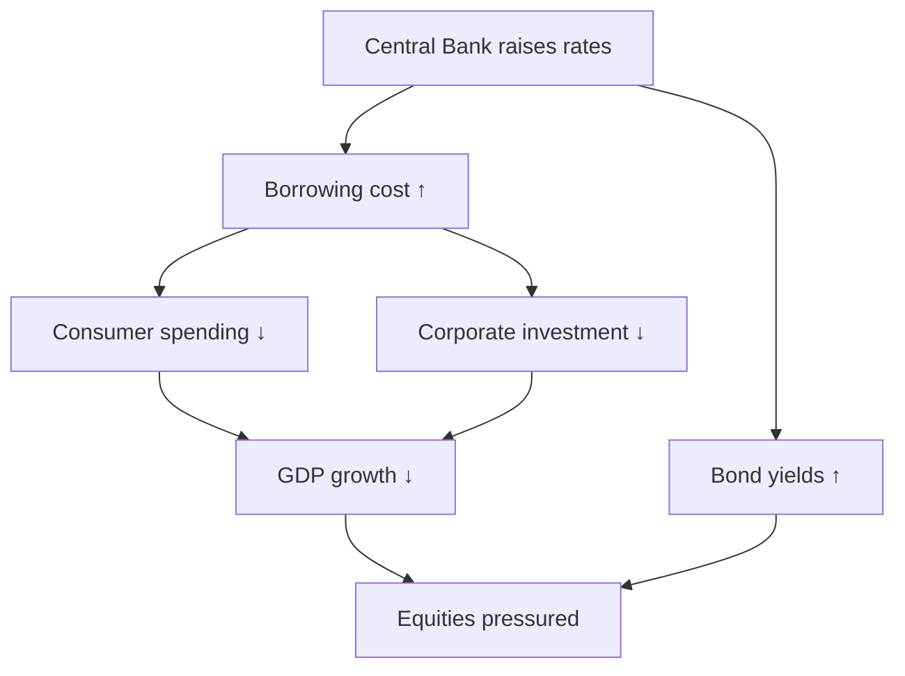
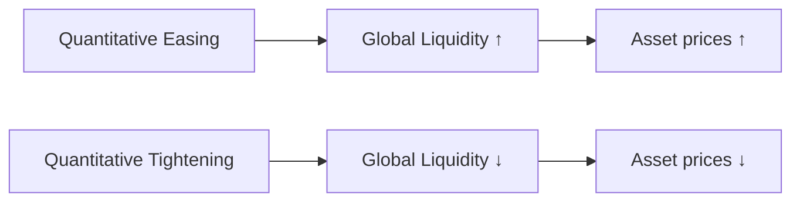

# MACRO_ECONOMICS

## Товч зорилго
Энэхүү баримт бичиг нь макроэдийн засаг (macroeconomics) ба түүний санхүүгийн зах зээлд үзүүлэх урт хугацааны нөлөөг эхлэгчдэд ойлгомжтой, системтэйгээр тайлбарлана. Бүх англи нэр томьёонд дуудлага, үндэс, монгол утга, энгийн тайлбар өгсөн.

---

## Яагаад макро эдийн засаг нь зах зээлийг урт хугацаанд удирддаг вэ?
- Макро хүчин зүйлс (хүү, мөнгөний нийлүүлэлт, инфляци) нь бүх хөрөнгийн үнэ тогтвортой байдлыг өөрчилдөг.
- Институц, төв банкууд бодлогын шийдвэрээр зах зээлийн ликвид, risk appetite-ийг хаах эсвэл нээх боломжтой.
- Урт хугацааны хөрөнгө оруулагчид эдгээр macro-шөнө үзүүлэлтийг харгалзан байрлал тохируулдаг учраас трендүүд бүтээгддэг.

---

## Гол нэр томьёонууд (pronunciation / root / Монгол утга / энгийн тайлбар)

### Macroeconomics
- Дуудлага: *макроэкономикс*
- Үндэс: "macro"=том, "economics"=эдийн засаг
- Монгол утга: нийт эдийн засгийн судалгаа
- Энгийн тайлбар: Нийт үйлдвэрлэл, ажилгүйдэл, инфляци зэрэг өргөн системийн үзүүлэлтүүдийг судална.

### Inflation
- Дуудлага: *инфлейшн*
- Үндэс: латин "inflare"=дүүргэх
- Монгол утга: үнэ өсөлт
- Энгийн тайлбар: Нийт бараа, үйлчилгээний үнэ өсөхөд мөнгөний худалдан авах чадвар буурна.

### Deflation
- Дуудлага: *дефлейшн*
- Үндэс: латин "de-"=доош, "flate"=өргөсөх
- Монгол утга: үнэ бууралт
- Энгийн тайлбар: Үнэ тасралтгүй буурч хүмүүс худалдан авалтаа хойшлуулж, эдийн засаг удааширна.

### Interest Rate
- Дуудлага: *интерэст рэйт*
- Үндэс: "interest"=сонирхол/хүү, "rate"=хукуп
- Монгол утга: зээлийн хүү
- Энгийн тайлбар: Мөнгө зээлэх зардал; төв банк өндөр хүү тогтоовол кредит алдагдсан, хөрөнгө багасна.

### Central Bank
- Дуудлага: *сентрал банк*
- Үндэс: төв байгууллага, "bank"=банк
- Монгол утга: улсын төв банк (мөнгөний бодлого хэрэгжүүлэх)
- Энгийн тайлбар: Хүү тогтоох, мөнгөний нийлүүлэлтийг зохицуулах байгууллага.

### Federal Reserve
- Дуудлага: *федерал резерв*
- Үндэс: АНУ-ын төв банкны нэр
- Монгол утга: АНУ-ын төв банк (Fed)
- Энгийн тайлбар: Дэлхийд ам.долларын байр суурийн улмаас Fed-ийн шийдвэр нь глобал зах зээлд хүчтэй нөлөө үзүүлнэ.

### Money Supply
- Дуудлага: *мани саплай*
- Үндэс: мөнгө + нийлүүлэлт
- Монгол утга: нийт эдийн засагт байгаа мөнгөний хэмжээ
- Энгийн тайлбар: Мөнгө их болборжих нь инфляцид түлхэж, хөрөнгийн үнэ өсөх шалтгаан болдог.

### Quantitative Easing (QE)
- Дуудлага: *квантитэйтив изинг*
- Үндэс: "quantitative"=тоон, "easing"=сулруулах
- Монгол утга: төв банкнаас зах зээлд их мөнгө нийлүүлэх бодлого
- Энгийн тайлбар: Төв банк бонд худалдаж авч, зах зээлийг liquidity-ээр дүүргэдэг.

### Quantitative Tightening (QT)
- Дуудлага: *квантитэйтив тайтнэн*
- Үндэс: "tightening"=хатууруулах
- Монгол утга: мөнгөний нийлүүлэлтийг хязгаарлах бодлого
- Энгийн тайлбар: Төв банк бондыг зарах эсвэл гүйцэтгэлээрээ мөнгө бууруулж, зах зээлээс liquidity-ийг татдаг.

### Bond Market
- Дуудлага: *бонд маркет*
- Үндэс: "bond"=өрийн хэрэгсэл, "market"=зах зээл
- Монгол утга: засгийн газар, компаниудын өрийн хэрэгслийн зах зээл
- Энгийн тайлбар: Хэдийд хэн хэр их зээл авч байгааг илтгэнэ; yields нь эрсдэлийн тойрог.

### Treasury Yield
- Дуудлага: *трежери йилд*
- Үндэс: "treasury"=татварын, "yield"=өргөлт/өдөржүүлэлт
- Монгол утга: Төрийн бондын өгөөж (жишээ: 10 жил)
- Энгийн тайлбар: Зээлийн зах зээлийн хүүгийн индикатор; өсвөл зах зээлд borrowing-ийг үнэтэй болгодог.

### Recession
- Дуудлага: *рэсешн*
- Үндэс: уналт, ойролцоо
- Монгол утга: эдийн засгийн агшилт
- Энгийн тайлбар: GDP буурч, ажилгүйдэл өсөх үе.

### Economic Cycle
- Дуудлага: *экономик сайнкл*
- Үндэс: өсөлт ба бууралтын давталт
- Монгол утга: эдийн засгийн мөчлөг
- Энгийн тайлбар: Өсөлт → оргил → агшилт → сэргэлт гэсэн мөчлөг.

### GDP
- Дуудлага: *жи ди пи*
- Үндэс: Gross Domestic Product
- Монгол утга: нийт дотоодын бүтээгдэхүүн
- Энгийн тайлбар: Улсын бүх бараа, үйлчилгээний нийлбэр үнэ; эдийн засаг том эсэхийн хэмжүүр.

### Unemployment
- Дуудлага: *анэмплоймент*
- Үндэс: ажилгүй байх төлөв
- Монгол утга: ажилгүй хүмүүсийн хувь
- Энгийн тайлбар: Ажилгүйдэл ихэсвэл хэрэглээ буурна, зах зээл суларна.

### Consumer Confidence
- Дуудлага: *консьюмер конфиденс*
- Үндэс: хэрэглэгчийн итгэл
- Монгол утга: иргэдийн ирээдүйн мөнгөн байдалд итгэх итгэл
- Энгийн тайлбар: Итгэл муудвал зарлага буурна, GDP-д нөлөөлнө.

### Risk-On / Risk-Off
- Дуудлага: *риск-он / риск-офф*
- Үндэс: өвөрмөц нэр томьёо
- Монгол утга: зах зээлд эрсдэлд дуртай эсвэл айж буй үе
- Энгийн тайлбар: Risk-on бол акции, risk-off бол алт, үнэт цаас, USD руу урсдаг.

### Currency Strength
- Дуудлага: *каренси стренгтх*
- Үндэс: тухайн валютын үнэ цэнэ бусад валюттай харьцуулах
- Монгол утга: валютын хүч чадал
- Энгийн тайлбар: Хэрэв USD хүчтэй байвал бусад актив (com modities) ихэвчлэн дарамтанд ордог.

### Global Liquidity
- Дуудлага: *глобал ликвидити*
- Үндэс: дэлхийн хэмжээний мөнгөний урсгал
- Монгол утга: дэлхий даяар хэмжээний нийлүүлэгдэж буй хөрөнгийн хэмжээ
- Энгийн тайлбар: Global QE үед хөрөнгийн үнэ өсч, зах зээлүүд дотоодын нөхцлөөс давсан өсөлт үздэг.

---

## Яагаад зах зээлүүд хүүгийн түвшинд хариу өгдөг вэ?
- Хүү нь зээлэх зардал тул, хөрөнгө оруулалтын үзэл баримтлал, компанийн хөрөнгө оруулалтын шийдвэр, хэрэглэгчийн зээл авах чадварыг шууд өөрчилдөг.
- Формул (пайрын ойлголт): $\text{Real Rate} \approx \text{Nominal Rate} - \text{Inflation}$
- Хүү өсвөл bond yields өсч, stock PE-үүд буурч, хөрөнгө эрсдэлтэй активуудаас зугтана (risk-off).

---

## Инфляци хэрхэн зах зээлийн зан төлөвийг өөрчилдөг вэ?
- Инфляци өсвөл төв банк хүүг өсгөх магадлалтай → borrowing-ийг үнэтэй болгоно.
- Өндөр инфляци нь real returns-ийг бага болгож, хөрөнгө оруулдаг хүмүүс risk appetite-ыг дахин үнэлнэ.
- Asset effects: equities-д PE compression, bonds-д yields өсөх, commodities-д үнэ өсөх.

---

## Төв банкууд яагаад бүгд зүйлийг нөлөөлдөг вэ?
- Төв банк бол мөнгөний нийлүүлэлт, хүүгийн бодлогын эх сурвалж. Тэд хүү, QE/QT шийдвэр гаргаж, системийн liquidity-г шууд өөрчилдөг.
- Fed-ийн шийдвэр нь глобал USD позиционинг дээр нөлөөлдөг тул дэлхий даяар хөрөнгө хөдөлдөг.

---

## Мөнгө хэвлэх (QE) нь хөрөнгийн зах зээлд хэрхэн нөлөөлдөг вэ?
- QE нь өгөгдөл дээр bond demand-ийг нэмэгдүүлж yields-ийг бууруулдаг.
- Бага yields нь хөрөнгийн үнэ цэнийг дэмжих (equities, real estate, crypto гэх мэт).

---

## Бондын зах зээл яагаад чухал вэ?
- Bond yields нь зах зээлийн "risk-free" хүүг тогтоодог; PV (present value) тооцоололд ашиглагддаг.
- Stocks болон bonds-ийн харилцан холбоо нь хөрөнгийн үнэ хөдөлгөөний үндсэн тэнхлэг болдог.

---

## Хөрөнгийн харилцаа (stocks, bonds, gold, USD)
- Stocks ↔ Bonds: Ерөнхийдөө yields өсвөл stocks дарамтлагдана (PE буурна).
- Gold ↔ USD: USD хүчтэйбол gold дарагддаг, харин USD сул үед алт өсдөг.
- Commodities ↔ Inflation: инфляци их байх үед commodities үнэ ихснэ.

---

## Макро айдас (macro fear) хэрхэн дэлхий даяар тархдаг вэ?
- Fed-ийн unexpected шийдвэр, geopolitics, commodity shocks, bank failures зэрэг нь confidence-ыг бууруулж глобал risk-off үүсгэнэ.
- Global liquidity нь холбогдсон тул нэг бүсийн асуудал дэлхийн зах зээлд цочрол өгнө.

---

## Институцийн байр суурь макро шилжилтийн үед
- Hedge funds, asset managers: duration adjustment, hedging with options, moving between equities/bonds/commodities.
- Banks: balance sheet restructure, lending standards tighten.
- Real money: reallocation across regions, currency hedging.

---

## Маркдаун хүснэгтүүд

### Инфляц vs дефляц зан төлөв

| Үзүүлэлт | Инфляц | Дефляц |
|---|---:|---:|
| Хэрэглэгчийн зан | Илүү хурдан зарцуулах | Худалдан авалтаа хойшлуулах |
| Төв банк хариу | Хүү өсгөх, QT | Хүү бууруулах, QE |
| Активын зан | Commodities↑, PE↓ | Bond yields↓, real assets demand↑ |

---

### Risk-On vs Risk-Off орчин

| Үзүүлэлт | Risk-On | Risk-Off |
|---|---:|---:|
| Зах зээлийн чиг | Stocks↑, credit spreads↓ | Stocks↓, bonds↑, gold↑ |
| Volatility | Бага | Их |
| Currency | Carry currencies mạnh | Safe-haven (USD, JPY) өсөх |

---

### Retail vs Institutional reaction

| Үзүүлэлт | Retail | Institutional |
|---|---|---|
| Шуурхай байдал | Ихэвчлэн реактив | Проактив, hedged |
| Info source | Social media, indicators | Macro data, flow, positioning |
| Positioning | Short-term, leverage | Duration, hedged, diversified |

---

## Диаграммууд

### Economic cycle

### Interest rate impact flow

### Liquidity expansion vs contraction

---

## Практик дасгалууд

### Daily macro observation checklist
- USD strength: __________
- 10y Treasury yield movement: __________
- Fed fund futures pricing (probability of hike/cut): __________
- CPI / PPI releases this week: __________
- Market risk sentiment (VIX, credit spreads): __________

### Federal Reserve event tracking
- Track meeting date, dot plot, statement, press conference.
- Note surprise vs expectation and market reaction (USD, yields, equities).

### Inflation reaction analysis
- After CPI release: monitor bonds (yields), real yields, and commodities for 48 hours.
- Note lead-lag between bond moves and equity moves.

### Market correlation observation
- Weekly: compute correlation matrix between S&P 500, 10y yield, Gold, USD index.
- Note shifts: if correlation(stock, bond) turns positive, risk dynamics have changed.

---

## "How macro affects beginner traders indirectly"
- Macro shifts change volatility, spreads, and liquidity — энэ нь execution-д нөлөөлнө.
- Хүүгийн шок нь margin call үүсгэж, leveraged retail-ууд алдагдалд оруулна.
- Macro news-ийн дараа fake breakout болон stop hunt-ууд ихсэж болно.

---

## "Why many traders ignore macro until it destroys them"
- Макро ойлголт нь төвөгтэй санагдаж эхлэгчид техникийн график руу л харах хандлагатай.
- Гэхдээ нэг том макро шок (rate shock, banking crisis) нь бүх technical setup-ыг устгадаг.
- Эхлэгчдэд зөвлөмж: basics-ийг өдөр тутам ажиглаж, Fed event-үүдэд position-аа багасгах.

---

## Финал: "Markets are connected systems, not isolated charts"
- Зах зээлүүд нь хооронд шүтэлцээтэй: supply, demand, liquidity, policy, psychology бүгд нийлж систем үүсгэнэ.
- Тиймээс нэг график дээрх тохиолдлыг бусад зах зээлүүдийн үзүүлэлтээр баталгаажуулж судла.

---

## Ашигтай формул болон жишээ
- Real interest rate: $$r_{real} \approx r_{nominal} - \pi$$
- Compound growth (GDP growth effect): $$GDP_{t+1} = GDP_{t}(1+g)$$
- Simple present value: $$PV = \frac{CF}{(1+r)^n}$$

---

## Практик эх сурвалж
- Fed statements, FOMC minutes, BEA, BLS, IMF, World Bank reports.
- Bond market primer, Treasury auction calendar.
- PROJECT_CORE.md, ROADMAP.md, RISK_MANAGEMENT_ADVANCED.md
