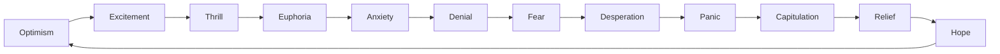

# MARKET_PSYCHOLOGY

## Төслийн зорилго
Энэ баримт бичиг нь зах зээлийн хүний зан төлөвт анхаарсан, эхний шатны ойлголт үйлдвэрлэхэд зориулагдсан. PROJECT_CORE.md-д заасан "үнэ бол ирээдүйн хүлээлтийн тусгал" философитой нийцүүлэн, зах зээлийг логик бус, сэтгэл хөдлөл ихтэй систем гэж харна.

## 1. Зах зээлийн хүний зан төлөв гэж юу вэ?
Зах зээл бол график биш. Зах зээл бол:
- айдас
- шунал
- хүлээлт
- мэдээллийн ялгаа
- crowd behavior
- narrative

Зах зээл дэх үнэ хөдөлгөөн нь ихэвчлэн логик биш, хүний мэдрэмж, итгэл, харж байгаа өгөгдөл, бусдын үйлдлээс үүдэлтэй.

---

## 2. Эмоциуд зах зээлийг яагаад хөдөлгөдөг вэ?
Логик ба тоон тооцоолол зах зээл дээр ажилладаг, гэхдээ хүмүүс бол бодит хугацаанд шийдвэр гаргадаг. Хүмүүс мэдрэмжээрээ:
- хурдан шийдвэр гаргаж,
- айдас ба шуналаас уруу татагдаж,
- бусдын хийж буй зүйлийг дагаж,
- өөрийн таамгийг баталгаажуулахыг эрж хайж,
- өөрсдийгөө давж гарч чадна гэж бодож,
- өөрийн алдагдалд уурыг бууруулж revenge trading хийдэг.

Эдгээр сэтгэл хөдлөл нь залуу, туршлага багатай оролцогчид болон том тоглогчдод ижил бишээр нөлөөлдөг. Өдрийн эцэст зах зээл дээр үнэ хөдөлгөөн нь хүний мэдрэмжийн эргэлттэй, багц цэг дээр төвлөрөхтэй холбоотой.

---

## 3. Гол ойлголтууд

### 3.1 Fear
- Дуудлага: *фиар*
- Үндэс: англи “fear” = айдас
- Монгол утга: эрсдэлээс айх сэтгэл
- Энгийн тайлбар: Алдагдал хүлээн зөвшөөрөхөөс өмнө зах зээлээс гарах шалтгаан.

### 3.2 Greed
- Дуудлага: *грид*
- Үндэс: англи “greed” = шунал
- Монгол утга: илүү ашиг хүсэх сэтгэл
- Энгийн тайлбар: Оролцогчид давхар ашиг авах гэж илүү удаан барих хэрэгцээ.

### 3.3 FOMO
- Дуудлага: *фомо*
- Үндэс: англи “Fear Of Missing Out” = хоцрох айдас
- Монгол утга: боломжоо алдаж магадгүй гэж айх
- Энгийн тайлбар: Бусдын орлогоос хоцрохгүй гэж яарч худалдан авах.

### 3.4 Panic Selling
- Дуудлага: *паник сэлинг*
- Үндэс: “panic”=айдас, “selling”=борлуулах
- Монгол утга: эмзэг мэдрэмжээс үүдсэн хурдан зарах
- Энгийн тайлбар: Үнэ унах үед сэтгэл алдсан худалдаачид бүхнийг богино хугацаанд зарж байна.

### 3.5 Euphoria
- Дуудлага: *евфориа*
- Үндэс: латин “euphoria” = сайн мэдрэмж
- Монгол утга: хэт их итгэл, урам зориг
- Энгийн тайлбар: Зах зээл зөвхөн дээшээ явна гэж итгэх, эрсдэл мартсан үе.

### 3.6 Revenge Trading
- Дуудлага: *ревенж трейдинг*
- Үндэс: “revenge”=харуулах, “trading”=арилжаа
- Монгол утга: алдсан ашиг хоосон нөхөх гэсэн хэт даврагдсан арилжаа
- Энгийн тайлбар: Алдагдалд ороод уурлаж, хурдан нөхөх гэж оролдож дахин байрлал авах.

### 3.7 Herd Mentality
- Дуудлага: *херд менталити*
- Үндэс: “herd”=төрөл, бүлэг, “mentality”=сэтгэлгээ
- Монгол утга: олон хүн дагасан сэтгэхүй
- Энгийн тайлбар: Бусдын хийж буйг дандаа зөв гэж үзэн дагах.

### 3.8 Confirmation Bias
- Дуудлага: *конфермейшн байас*
- Үндэс: “confirmation”=баталгаажуулалт, “bias”=тэгш бус байдал
- Монгол утга: өөрийн таамгийг батлуулахыг эрмэлзэх
- Энгийн тайлбар: Өөрийн бодолтой таарах мэдээллийг сонгож, эсрэг мэдээллийг үл ойшоох.

### 3.9 Overconfidence
- Дуудлага: *овэрконфиденс*
- Үндэс: “over”=дээр, “confidence”=итгэл
- Монгол утга: хэт их итгэл
- Энгийн тайлбар: Бүх шийдвэр дээр өөрөө үргэлж зөв гэж бодох.

### 3.10 Market Manipulation
- Дуудлага: *маркет манипюлэйшн*
- Үндэс: “market”=зах зээл, “manipulation”=туулах, захиран турших
- Монгол утга: зах зээлийг зорилготойгоор удирдах
- Энгийн тайлбар: Том тоглогчид үнэ, зэрэгцээ мэдээг ашиглан хүмүүсийн үйлдлийг өөрчлөх.

### 3.11 Narrative
- Дуудлага: *нэрайтив*
- Үндэс: латин “narrare”=ярих
- Монгол утга: өгүүлэмж, түүх
- Энгийн тайлбар: Зах зээлд итгэл төрүүлэх харуусалтай түүх, сэдэл.

### 3.12 Crowd Psychology
- Дуудлага: *крауд сайколожи*
- Үндэс: “crowd”=олон хүн, “psychology”=сэтгэл судлал
- Монгол утга: олон хүний сэтгэл хөдлөлийн нийлбэр
- Энгийн тайлбар: Бүхэлдээ зах зээлийн оролцогчдын мэдрэмж нэг чиглэл рүү явж байгаа байдал.

### 3.13 Emotional Cycle of Markets
- Дуудлага: *эмоушнал сайкл оф маркетс*
- Үндэс: “emotional”=сэтгэл хөдлөлтэй, “cycle”=дугаарлах, “markets”=зах зээл
- Монгол утга: зах зээлийн мэдрэмжийн давталт
- Энгийн тайлбар: Зах зээл айдас, шунал, паник, эвфориа зэрэг мөчлөгөөр явдаг.

---

## 4. Зах зээлийн сэтгэл хөдлөлийн мөчлөг
Энэ мөчлөг нь хүмүүс зах зээлд хэрхэн мэдрэмжээр хариу үйлдэл үзүүлдэгийг харуулна.

Энэ диаграм нь зах зээлийн мөчлөгийг энгийнээр харуулна. Эхлээд найдвар төрж, дараа нь дэлгэрэнгүй нөлөө, эцэст нь айдас руу шилждэг.

---

## 5. Тодорхой ойлголтуудын жишээ

### Fear
- Түүхэн жишээ: 2008 оны санхүүгийн хямрал. Lehman Brothers унаж, зах зээлүүд богино хугацаанд 50 хувиас дээш унав.
- Яагаад болсон бэ: Хүснэгттэйн мэдээлэл буруу байсангүй, гэхдээ хүмүүсийг банк дампуурна гэсэн айдас бүгдийг зарахад хүргэлээ.

### Greed
- Түүхэн жишээ: 1999-2000 оны дотком ширээний бал. Зарим хувьцаа ашигтай компани биш ч үнэ маш их өссөн.
- Яагаад болсон бэ: Хүмүүс ирээдүйд бүх зүйл веб дээр байна гэж шуналтай итгэж, үнэ хэт их өссөн.

### FOMO
- Түүхэн жишээ: 2021 оны крипто оргил. Bitcoin болон Dogecoin хурдан өссөн үед олон хүн орж ирсэн.
- Яагаад болсон бэ: "Аль хэдийн 2x, 3x алдчихлаа" гэсэн бодол FOMO-ыг төрүүлж, хуучин суурь шинжигүйгээр оролцуулах болсон.

### Panic Selling
- Түүхэн жишээ: 1987 оны Black Monday. DJIA нэг өдөрт 22.6% унасан.
- Яагаад болсон бэ: Хэд хэдэн алдаатай алгоритм, мэдрэмжийн хэтэрхий хүчтэй нийлбэр нь богино хугацаанд паник зохион байгуулсан.

### Euphoria
- Түүхэн жишээ: 1929 оны зах зээлийн оргил. Нэгээс олон хүн зах зээл хэзээ ч унахгүй гэж итгэсэн.
- Яагаад болсон бэ: Үнийн өсөлт нь хүмүүсийг үнэхээр зөв гэж итгүүлж, эрсдэлийг мартсан.

### Revenge Trading
- Түүхэн жишээ: 2000 оны дотком дараа арилжаачид алдсан алдагдалгаа нөхөх гэж шууд байрлал авсан.
- Яагаад болсон бэ: Алдагдалд орж, ууртай хүн хурдан нөхөх гэж эрсдэл өндөр байрлал авсан.

### Herd Mentality
- Түүхэн жишээ: 2017 оны крипто бум. Бүх хүний анхаарал altcoin-уудад чиглэсэн.
- Яагаад болсон бэ: Хүмүүс бусдын орлогоос хоцрохгүй гэж санаандгүй дагасан.

### Confirmation Bias
- Түүхэн жишээ: 2020 оны эхээр зарим хүмүүс COVID-19 нь зүгээр өнгөрнө гэж зөвхөн сайхан мэдээг хайж байсан.
- Яагаад болсон бэ: Үр дүнд нь эрсдлийг үнэлэлгүй, буруу шийдвэр гаргасан.

### Overconfidence
- Түүхэн жишээ: 2007 онд олон банк өндөр ашигт компанитай гэж бодож, кредитийг хэт их өсгөсөн.
- Яагаад болсон бэ: Тэд өөрсдийгөө ухаалаг гэж үзэж, эрсдэлийг дутуу үнэлсэн.

### Market Manipulation
- Түүхэн жишээ: 2010 оны Flash Crash. 36 минутын дотор DJIA 1000 цэг унасан.
- Яагаад болсон бэ: Хүчтэй худалдан авалт/зарлага, алгоритм, хүний хариу үйлдэл нийлж зах зээлийг манипуляцийг үүсгэсэн.

### Narrative
- Түүхэн жишээ: "Буцааж хүн төрөлхтөнтэй холбогдох" гэсэн дэлхий даяар интернетийн түүх NFT болон крипто зах зээлд хүчтэй нөлөөлсөн.
- Яагаад болсон бэ: Логик бус ч өгүүлэмж хүмүүсийн итгэлийг хөдөлгөж, үнэ өсгөсөн.

### Crowd Psychology
- Түүхэн жишээ: 2007-2008 оны орон сууцны пузырь. Мянга мянган хүмүүс байр авах гэж өрсөж, үнэ илт хэтэрсэн.
- Яагаад болсон бэ: Хуримтлагдсан итгэл, бусад хүмүүс хийнэ гэж бодоод дагасан.

### Emotional Cycle of Markets
- Түүхэн жишээ: Өндөр оргил -> эвфориа -> паник -> гүйцэтгэл. Энэ мөчлөг 1929, 1987, 2000, 2008, 2020 онд давтагдсан.
- Яагаад болсон бэ: Зах зээлийн оролцогчдын мэдрэмж нэг жигд бус давталттайгаар шилжиж, үнэ хүчтэй хөдөлсөн.

---

## 6. Beginner mistakes
- **Жигд тооцоогүйгээр шалтгаангүй оролцох**: FOMO дээр суурилсан оролцоо.
- **Алдаагаа өөртөө буруу тохох**: Revenge trading хийх.
- **Дасгалгүйгээр нарийн механизм хайх**: Нэг өгүүлэмж дээр тулгуурлах.
- **Нүүрлэлийг анзаарахгүй байх**: Narrative-ыг хэт итгэх.
- **Өөрийгөө дэндүү итгэлтэй гэж бодох**: overconfidence.

---

## 7. Warning signs
- Зах зээл хэт хурдан өсөж, эвфориа илэрсэн.
- Мэдээлэл нотолгоогоос илүү өгүүлэмж дээр тулгуурлаж байвал.
- Crowd mentality илт мэдрэгдэж, "бүгд яг одоо хийх хэрэгтэй" гэж бодвол.
- Өөрийн шийдвэр бодит шалгуургүй болбол.
- Алдагдалд дарагдаж revenge trading хийх хүсэл төрвөл.
- Harmonic, disciplined system-с хазайж, айдас, шуналд автвал.

---

## 8. Psychological survival rules
- **Risk first. Profit second.** (Эрсдэл эхэнд)
- **Survival is the first strategy.** (Амьд үлдэх нь эхний зорилго)
- **No data, no confidence.** (Өгөгдөлгүй итгэл үгүй)
- **Never confuse luck with skill.** (Азтайг чадвар гэж бүү андуур)
- **Journal everything.** (Бүгдийг тэмдэглэ)
- **Wait for evidence, битгий дагах FOMO-ыг.**
- **Know when to walk away, паникт бүү оро.**
- **Use risk management, revenge trading-ээс зайла.**

---

## 9. Daily observation questions
- Өнөөдөр зах зээлд ямар мэдрэмж давамгайлж байна?
- Хүмүүс Fear, Greed, FOMO эсвэл Panic Selling дээр байна уу?
- Өгөгдөл, narrative аль нь давамгайлж байна?
- Энэ хөдөлгөөн crowd psychology-оос үүдэж байна уу?
- Би өнөөдөр ямар сэтгэл хөдлөл дээр суурилсан шийдвэр гаргаж байна?
- Market structure, liquidity, institutional behavior ямар харилцан үйлчилж байна?

---

## 10. Self-reflection questions
- Миний шийдвэр логик дээр суурилсан уу, эсвэл мэдрэмж дээр суурилсан уу?
- Би confirmation bias-т автаж байна уу?
- Миний overconfidence хаана илэрч байна вэ?
- Би revenge trading хийж магадгүй юу?
- Хэрэв би бусдын дагаж байгаагаар аашилбал яах вэ?
- Энэ давтамж надад хэрхэн суралцах боломж өгч байна вэ?

---

## 11. How professional traders think differently from gamblers
- **Professional traders**:
  - Дүрэм, risk management, data journal-д итгэдэг.
  - Probability, expectancy, backtesting ашиглан системээ үнэлдэг.
  - Сэтгэл хөдлөлөө удирдаж, discipline-ийг сахидаг.
  - Алдагдалтай байрлалыг төлөөх биш, удирдаж гардаг.
  - Зах зээлийг гэрээслэл гээд авдаггүй; тэд боломжийн өрсөлдөгч гэж үздэг.

- **Gamblers**:
  - Аз, хүсэл, эвфориа дээр найддаг.
  - Богино хугацааны хожилд анхаардаг.
  - Сэтгэл хөдлөлдөө автаж revenge trading болон chasing-ийг хийдэг.
  - Алдагдлыг нөхөх гэж удаан барьж, хэт итгэлтэй болдог.
  - Зах зээлийг казино гэж хардаг.

Товчхон: мэргэжилтэн тоглоомын системтэй, дүрэмтэй, эрсдэлээ тооцдог; мөрийтэй тоглогч бол мэдрэмж дээр тулгуурлаж, аз хүлээдэг.

---

## 12. Disciplined vs Emotional Trading

| Үзүүлэлт | Disciplined trading | Emotional trading |
|---|---|---|
| Шийдвэрийн үндэс | Өгөгдөл, дүрэм, анализ | Мэдрэмж, айдас, шунал |
| Алдагдлыг хүлээх байдал | Зөв зохион байгуулалттай | Revenge trading, panic exit |
| Журналын хэрэглээ | Ороо, гарлаа бичиж дүгнэдэг | Бичдэггүй эсвэл хаядаг |
| Стратеги | Тогтмол тесттэй, backtesting | Сэнхрэх, нэг удаагийн систем |
| Ердийн үр дүн | Тогтвортой суралцсан өсөлт | Маш өндөр хэлбэлзэл, их дэгдэлт |

---

## 13. Practical observation exercises
1. **Emotion diary**:
   - Өдөр бүр үнэ хөдөлж буйг ажиглаж, Fear, Greed, FOMO, Panic эсэхийг тэмдэглэ.
   - Жишээ: "Өнөөдөр зах зээл эхлээд FOMO-оор дүүрсэн, дараа нь Panic Selling руу шилжсэн." 
2. **Narrative audit**:
   - Нэг мэдээ, өгүүлэмжийн тайлбарыг сонгож, энэ нь жинхэнэ өгөгдлийг давж байгаа эсэхийг шалга.
   - Жишээ: "Энэ компани NFT-тай гэж хэлсэн нь үнэхээр орлого өсгөх үү?" 
3. **Herd check**:
   - Таны шийдвэрийг бусдын хийсэн үйлдэлд тулгуурласан эсэхийг асуу.
   - Жишээ: "Би энэ хувьцааг авав, учир нь найз маань авсан." 
4. **Confirmation bias test**:
   - Өөрийн таамаглалыг эсэргүй мэдээллээр тогтоож шалга.
   - Жишээ: "Хэрвээ үнэ буурвал энэ нь ямар шалтгаантай вэ?" 
5. **Weekly review**:
   - Долоо хоног бүр өөрийн мэдрэмж, шийдвэрийг дүгнэж, аль нь логик, аль нь сэтгэл хөдлөл байсныг бич.

---

## 14. Дүгнэлт
Зах зээлд хүний зан төлөв мэдлэг нь хамгийн чухал давхарга. PROJECT_CORE.md-д заасан "Price is not truth. Price is expectation." зарчим нь энэ хайрцагт таарч байна: үнэ нь хүний хүлээлт, айдас, шуналын цуглуулсан илэрхийлэл.

- Хүн бүр логикгүй байх боломжтой.
- Эмоциуд зах зээлийг илүү хурдан хөдөлгөдөг.
- Тогтвортой амжилтанд хүрэхийн тулд psychology-г ойлгож, өөрөө түүний эсрэг ажиллах арга барилтай байх хэрэгтэй.
- Журнал нь сэтгэл хөдлөлөө харж, алхам бүрээ илүү тооцоолсон болгодог.
