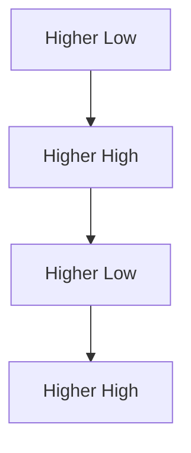
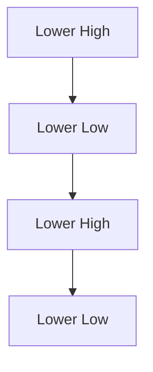
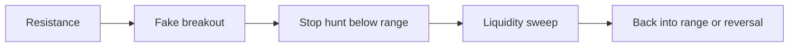
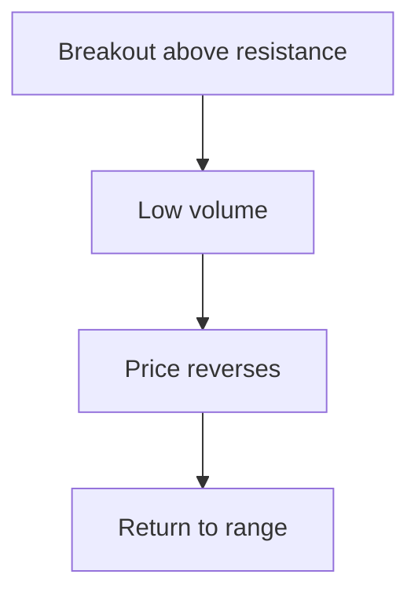
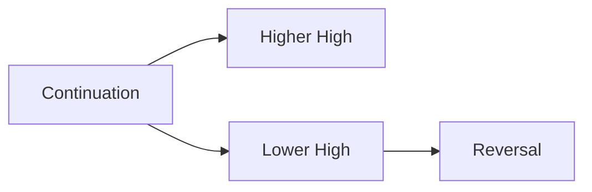

# MARKET_STRUCTURE

## Төслийн зорилго
Энэ баримт бичиг нь Market Structure буюу зах зээлийн бүтцийн ойлголтыг эхлэгчдэд ойлгомжтой монгол хэлээр тайлбарлаж, яагаад арилжааны үндсэн суурь болохыг тодорхойлно.

---

## Market Structure гэж юу вэ?
- Дуудлага: *маркет стркчр*
- Үндэс: "market"=зах зээл, "structure"=бүтэц
- Монгол утга: зах зээлийн үнэ хэрхэн хэлбэржиж байгааг харуулсан бүтэц
- Энгийн тайлбар: Trend, support/resistance, swing high/low зэрэг нийлснийг бид зах зээлийн бүтэц гэж нэрлэнэ.

Market Structure нь indicators биш, зах зээлийн бодит хөдөлгөөн, тэдний хэлбэрүүд дээр тулгуурлана. Энэ нь трейдэнд хамгийн чухал суурь бөгөөд загваруудыг илүү зөвөөр тайлбарлахад тусална.

---

## Гол нэр томьёонууд

### Trend
- Дуудлага: *тренд*
- Үндэс: англи "trend" = чиглэл
- Монгол утга: үнэ хэрхэн хөдөлж байгааг харуулсан ерөнхий чиглэл
- Энгийн тайлбар: Үнэ удаан хугацаанд дээшээ эсвэл доошоо хөдөлж байвал тренд үүснэ.

### Uptrend
- Дуудлага: *аптренд*
- Үндэс: "up"=дээш, "trend"=чиглэл
- Монгол утга: үнэ дээшлэх чиглэл
- Энгийн тайлбар: Higher highs, higher lows-ийн дараалал үүссэн үед uptrend гэж үзнэ.

### Downtrend
- Дуудлага: *даунтренд*
- Үндэс: "down"=доош, "trend"=чиглэл
- Монгол утга: үнэ доошлох чиглэл
- Энгийн тайлбар: Lower lows, lower highs-ийн дараалал үүссэн үед downtrend гэж үзнэ.

### Range
- Дуудлага: *рэнж*
- Үндэс: англи "range" = хүрээ
- Монгол утга: үнэ тусгалыг нэг талбар дотор давтан хөдөлж байгааг хэлнэ
- Энгийн тайлбар: Үнэ орон гарангүй, support ба resistance-ийн дунд хэлбэлзэж байна.

### Consolidation
- Дуудлага: *консолидэйшн*
- Үндэс: "consolidate"=бүтэцжүүлэх
- Монгол утга: үнэ тодорхой талбарт тогтвортойжиж, дараагийн хөдлөлт бэлтгэгдэж байгаа үе
- Энгийн тайлбар: Зах зээл түр завсарлаж, дараагийн хөдөлгөөнийг бэлтгэнэ.

### Breakout
- Дуудлага: *брэйкаут*
- Үндэс: "break"=таслах, "out"=гадагш
- Монгол утга: үнэ support эсвэл resistance-ийг давж гарсан үйлдэл
- Энгийн тайлбар: Зах зээл шинэ чиглэл рүү шилжих эхлэл.

### Fake Breakout
- Дуудлага: *фэйк брэйкаут*
- Үндэс: "fake"=худал, "breakout"=давж гарах
- Монгол утга: үнэ түр охид давсан мэт боловч буцаад талбар руу орох
- Энгийн тайлбар: Энэ нь олон beginners-ийг барьцаалан алдагдалд хүргэдэг.

### Support
- Дуудлага: *саппорт*
- Үндэс: латин "supportare" = дэмжих
- Монгол утга: үнэ буух үед эргэн татагдах боломжтой доод түвшин
- Энгийн тайлбар: Худалдан авагчид хүчтэй ирэх магадлалтай цэг.

### Resistance
- Дуудлага: *резидэнс*
- Үндэс: латин "resistere" = эсэргүүцэх
- Монгол утга: үнэ өсөх үед саад болох дээд түвшин
- Энгийн тайлбар: Зарагчид бөөгнөрөх магадлалтай цэг.

### Swing High
- Дуудлага: *свинг хай*
- Үндэс: "swing"=ингэх, "high"=өндөр
- Монгол утга: одоогийн хурдтай хамгийн өндөр цэг
- Энгийн тайлбар: Хятадад үнэ эргэж өмөрдөг орон.

### Swing Low
- Дуудлага: *свинг лоу*
- Үндэс: "swing"=ингэх, "low"=доод
- Монгол утга: одоогийн хамгийн доорх цэг
- Энгийн тайлбар: Үнэ эргэн дээшлэх боломжтой доод цэг.

### Higher High
- Дуудлага: *хайэр хай*
- Үндэс: "higher"=илүү өндөр, "high"=өндөр
- Монгол утга: өмнөх өндөр цэгээс илүү өндөр шинэ өндөр
- Энгийн тайлбар: Uptrend-ийн шинж.

### Higher Low
- Дуудлага: *хайэр лоу*
- Үндэс: "higher"=илүү өндөр, "low"=доод
- Монгол утга: өмнөх доод цэгээс илүү өндөр доод цэг
- Энгийн тайлбар: Uptrend үргэлжлэхийн баталгаа.

### Lower High
- Дуудлага: *лоуэр хай*
- Үндэс: "lower"=илүү доогуур, "high"=өндөр
- Монгол утга: өмнөх өндөр цэгээс бага шинэ өндөр
- Энгийн тайлбар: Downtrend-ийн эхлэл байж болно.

### Lower Low
- Дуудлага: *лоуэр лоу*
- Үндэс: "lower"=илүү доогуур, "low"=доод
- Монгол утга: өмнөх доод цэгээс илүү доогуур доод цэг
- Энгийн тайлбар: Downtrend үргэлжилж байгааг харуулна.

### Break of Structure
- Дуудлага: *брэйк оф стркчр*
- Үндэс: бүтцийн эвдрэл
- Монгол утга: зах зээлийн одоогийн бүтэц өөрчлөгдөж байна
- Энгийн тайлбар: Higher high/higher low эсвэл lower low/lower high дараалал алдагдсан үед.

### Change of Character
- Дуудлага: *чейнж оф кэрактэр*
- Үндэс: зан чанарын өөрчлөлт
- Монгол утга: үнэ одоогоос өөр хандлага руу шилжиж байгааг харуулна
- Энгийн тайлбар: Хэв маяг өөрчлөгдөх үед market structure шинэ чиглэлийг заана.

### Momentum
- Дуудлага: *моментум*
- Үндэс: хөдөлгөөний хүч
- Монгол утга: үнэ хэр хурдан өөрчлөгдөж байгааг хэмжих
- Энгийн тайлбар: Том candle, өндөр volume дахь хөдөлгөөн өндөр momentum-ыг илтгэж болно.

### Continuation
- Дуудлага: *континьюэйшн*
- Үндэс: үргэлжлэл
- Монгол утга: тренд үргэлжилж байгааг заах
- Энгийн тайлбар: Үнэ бага хугацаанд завсарласны дараа үндсэн чиглэлээ үргэлжлүүлнэ.

### Reversal
- Дуудлага: *рэвёрсал*
- Үндэс: эсрэг чиглэлд буцах
- Монгол утга: тренд солигдон өөр чиглэлд орох
- Энгийн тайлбар: Uptrend->Downtrend эсвэл Downtrend->Uptrend шилжилт.

---

## Яагаад бүтэц indicators-ээс илүү чухал вэ?
- Indicators нь өмнөх үнэ хөдөлгөөнийг илэрхийлдэг, харин бүтэц нь үнэ одоо юу хийж байгааг шууд харуулна.
- Trend, support, resistance зэрэг бүтэц нь зах зээлийн логик, орлогын боломжийг тодорхойлдог.
- Indicator-д найдах нь ихэвчлэн хоцрогдсон дохио авна; structure бол тодорхой нөхцөл.

---

## Институцүүд бүтэцийг хэрхэн уншдаг вэ?
- Тэд higher high/higher low, lower high/lower low дарааллыг хянадаг.
- Том тоглогчид structure-ийг үзээд liquidity, order flow, entry/exit түвшинг тодорхойлдог.
- Тэд range, breakout, continuation, reversal-г хүчтэй илрүүлэхэд зориулсан гүнзгий context ашиглана.

---

## Яагаад beginners fake breakout-д баригддаг вэ?
- Fake breakout нь хүмүүсийн FOMO-г өдөөж, индикаторын дохио дагасан шийдвэр авчирна.
- Эхлэгчид support/resistance-т зөв байрлал тохируулалгүйгээр ордог.
- Зах зээлийн хөдөлгөөнийг заримдаа өөрсдөө зогсооход буруу гэж ойлгодог.

---

## Бүтэц ба liquidity-ийн харилцаа
- Support болон resistance нь liquidity-ийн төвүүд болж чадна.
- Breakout-той зэрэгцэн liquidity sweep, stop hunt нь түгээмэл.
- Range-д liquidity нь талбарын дотор байх ба breakout-д түншлэх янз бүрийн чиглэлд шилждэг.

---

## Бүтэц ба сэтгэл зүйн харилцаа
- Uptrend-д хүмүүс итгэж, greed-тэй болдог.
- Downtrend-д хүмүүс айж, panic selling хийж болзошгүй.
- Range-д uncertainty болно; traders утгагүй оролцож, FOMO-т баригдах магадлал өндөр.

---

## Multi-timeframe structure
- Том timeframe-д гол trend, жижиг timeframe-д entry/exit-үүд харагддаг.
- Professionals өндөр timeframe-ээс direction авч, бага timeframe-д timing хийхийг илүүд үздэг.
- Нэг timeframe-т uptrend харагдаж байхад өөр timeframe-д range эсвэл дарангуйлсан downtrend байж болно.

---

## Trend vs noise
- Trend нь тодорхой higher high/higher low буюу lower low/lower high-аар тодорхойлогддог.
- Noise нь жижиг, санамсаргүй хэлбэлзэл; том structured хөдөлгөөн биш.
- Зөв ялгахын тулд support/resistance, volume, momentum-ийг хослуулан харна.

---

## Яагаад market structure fractal юм?
- Зах зээлийн бүтэц нь өөр өөр timeframe-д давтагддаг.
- Жишээ нь daily uptrend дотор 1H range, 15m continuation, 5m pullback бүгд байх боломжтой.
- Энэ нь price action-ийг зөв тайлбарлахад fractal хэв маяг хэрэгтэйг харуулна.

---

## Маркдаун хүснэгтүүд

### Healthy trend vs weak trend

| Үзүүлэлт | Healthy trend | Weak trend |
|---|---|---|
| Swing structure | Clear HH/HL эсвэл LH/LL | Давхар, муу тодорхойлогдсон |
| Momentum | Үүргэлтэй, volume дэмждэг | Суларсан, volume багассан |
| Pullback | Зөвшөөрөгдсөн, жижиг | Удаан, гүнзгий эсвэл давтагдсан |
| Breakout | Батлагдсан, backtest-д амархан | Fake, буцаад range руу ордог |

---

### Emotional interpretation vs structural interpretation

| Шинж | Emotional | Structural |
|---|---|---|
| Үйлдэл | FOMO, hope, fear | Support, resistance, swing pattern |
| Шийдвэр | Тайван бус, түргэн | Systematic, дүрэмтэй |
| Хариу | Reaction | Response |
| Давтагдах | Хэсэгчилсэн | Давтагдсан бат бөх хэв маяг |

---

### Retail breakout behavior vs institutional behavior

| Үзүүлэлт | Retail breakout | Institutional |
|---|---|---|
| Орц | Breakout дээр шууд орж | Confirmation, liquidity-ийн цэвэрлэлт хүлээж орно |
| Stop placement | Давталын түвшин дээр | logical, structure-д нийцсэн |
| Exit | Profit target эсвэл panic | Plan, risk management, partial exit |
| Reaction to fake breakout | Асуудал гарна | Өнгөрөх боломжтой, холбогдох юм ║

---

## Диаграммууд

### Uptrend structure

### Downtrend structure

### Range liquidity sweep

### Fake breakout example

### Trend continuation vs reversal

---

## Практик дасгалууд

### Daily structure mapping
- Өдөр бүр нэг график дээр support, resistance, swing high/low-ыг тэмдэглэ.
- Тухайн day, session-д uptrend, downtrend, range аль нь илүү давамгайлж байгааг тодорхойл.
- Энэ нь таны perception-ийг сайжруулна.

### Trend identification exercise
- 3 timeframe-д (ж: daily, 4H, 1H) structure-г хараад trend direction-г бич.
- Higher high/higher low байгаа эсэхийг шалга.

### Fake breakout observation
- Өдөр бүр 1-2 breakout-ыг анзаарч, volume болон дараах price action-ыг тэмдэглэ.
- Fake breakout болсны дараа price яаж буцаж орж байгааг ажигла.

### Structure journaling checklist
- Энэ market structure uptrend, downtrend эсвэл range гэж тодорхойлоо.
- My edges ямар түвшинд байна вэ?
- Энэ нь fake breakout үү, эсвэл continuation уу?
- Миний entry, stop, target structure-д таараж байна уу?
- Өнөөдрийн сэтгэл хөдлөл намайг structure-ээс гажуулав уу?

---

## How professionals simplify market structure
- Тэд "Market Structure"-г зөвхөн higher highs/lows, lower highs/lows дээр төвлөрүүлдэг.
- Indicator-ыг хэрэглэхдээ structure-ийг баталгаажуулах төдийд ашиглана.
- Тэд "Market Structure"-г charts дээр шууд төгс ойлголт болгодог, илүү нарийн шалгалт хийдэг.

---

## Why overcomplicated chart analysis becomes dangerous
- Хэт олон indicator, паттерн, Fibonacci зэрэг нь анхаарлыг сарниулж, decision fatigue-ыг нэмэгдүүлнэ.
- Энэ нь эхлэгчдийг structure-ийг харгалзахгүйгээр сигналыг дагах хэв маягт оруулна.
- Илүүдэл мэдээлэл нь simple, баталгаатай нөхцөлүүдээс холдуулна.

---

## How to practice market structure without risking money
- Paper trading-ээр structure map хийж, entry/exit-ийг тэмдэглэ.
- Chart study: historical charts дээр breakout, fake breakout, trend, range-ыг ажиглах.
- Journaling: observation, decision logic, outcome-ыг бичих.
- Simulation: demo account-д бага size-тай, risk-гүй байрлал авах.

---

## Дүгнэлт
Market Structure бол арилжааны суурь. Энэ нь зах зээлийг индикатор бус, үнэ болон хүний зан төлөвийн зохион байгуулалттай систем гэж хардаг. Хэрэв та бүтэцийг сайн ойлговол, fake breakout, noise-оос ухаалгаар салах боломжтой.
