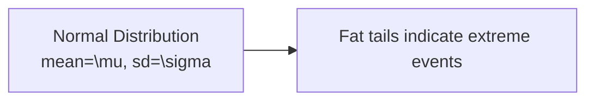
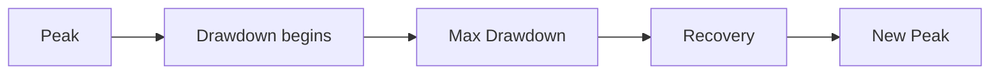
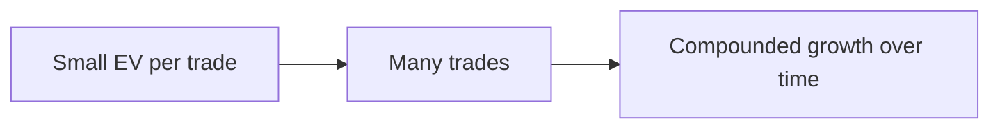

# QUANT_ANALYSIS

## Товч зорилго
Энэхүү баримт бичиг нь квантитатив (quantitative) шинжилгээ гэж юу болох, яагаад Wall Street өгөгдөлд тулгуурладаг, болон статистик/магадлалын ойлголтуудыг эхлэгчдэд ойлгомжтой монгол хэлээр тайлбарлахад зориулагдсан.

---

## Квантитатив шинжилгээ гэж юу вэ, яагаад чухал вэ?
- Дуудлага: *квант анализ*
- Үндэс: "quantitative"=тоо, "analysis"=шинжилгээ
- Монгол утга: өгөгдөлд тулгуурласан тоон шинжилгээ
- Энгийн тайлбар: Өгөгдөл, статистик, симуляц, backtest-ээр стратеги баталгаажуулж execution-ийн магадлалыг сайжруулах аргууд.

Wall Street-д количеатив арга ашиглах нь учиртай: том тооны өгөгдөл, tốc хүний үйлдлийг хэмжих, жижиг edge-үүдийг олж, probability-first шийдвэр гаргах боломжийг өгдөг.

---

## Гол нэр томьёонууд (pronunciation / root / Монгол утга / энгийн тайлбар)

### Quantitative Analysis
- Дуудлага: *квантитэйтив аналисис*
- Үндэс: "quant"=тоо, "analysis"=шинжилгээ
- Монгол утга: тоон шинжилгээ
- Энгийн тайлбар: өгөгдөл дээр суурилсан шийдвэр гаргах арга.

### Probability
- Дуудлага: *пробабилити*
- Үндэс: магадлал
- Монгол утга: боломжийн хэмжүүр
- Энгийн тайлбар: Ямар нэг үйл явдал болох магадлал (0-1).

### Statistics
- Дуудлага: *статистикс*
- Үндэс: өгөгдлийн шинж
- Монгол утга: өгөгдлийг дүн шинжилгээ хийх математик арга
- Энгийн тайлбар: Өгөгдлөөс дунджаа, тархалт, хамаарлыг тодруулах.

### Expected Value
- Дуудлага: *экспектэд вэлюэ*
- Үндэс: хүлээгдэж буй дундаж үнэ цэнэ
- Монгол утга: дундаж үр ашиг
- Энгийн тайлбар: Урт хугацаанд нэг стратеги нэг арилжаа тутамд дунджаар хэдийг олохыг тооцно.

- Формул: $$EV = p\times W - (1-p)\times L$$

### Win Rate
- Дуудлага: *вин рэйт*
- Үндэс: ялалтын хувь
- Монгол утга: ялах тохиолдлын хувь
- Энгийн тайлбар: Бүх арилжаанаас хэд нь ашигтай дуусдаг вэ.

### Variance
- Дуудлага: *варианс*
- Үндэс: тархалтын хэмжүүр
- Монгол утга: өгөгдлийн хувьсалтийн дундаж квадрат
- Энгийн тайлбар: Үр өгөөж хэр их тархаж байгааг харуулна.

- Формул: $$\mathrm{Var}(X)=E[(X-\mu)^2]$$

### Standard Deviation
- Дуудлага: *стандард девиэйшн*
- Үндэс: variance-ын квадрат үндэстэй холбоотой
- Монгол утга: стандарт хазайлт
- Энгийн тайлбар: Серийн тархалтын ердийн хэмжүүр: $$\sigma=\sqrt{\mathrm{Var}(X)}$$

### Correlation
- Дуудлага: *коррелейшн*
- Үндэс: харилцан хамаарал
- Монгол утга: хоёр хувьсагч хэрхэн хамт хөдөлж байгааг үзүүлнэ
- Энгийн тайлбар: +1 бол төгс ээр, -1 бол эсрэг чиглэл.

### Volatility
- Дуудлага: *волатилити*
- Үндэс: огцом өөрчлөгдөх байдал
- Монгол утга: үнэ хэр хурдан савалж байгааг хэмжих
- Энгийн тайлбар: Илүү их volatility нь их эрсдэл, их боломж гэсэн үг.

### Edge
- Дуудлага: *эдж*
- Үндэс: давуу тал
- Монгол утга: системийн хүлээгдэж буй ашигтай тал
- Энгийн тайлбар: Нэг стратеги бусдаас илүү EV өгдөг байдал.

### Backtesting
- Дуудлага: *бэк-тестинг*
- Үндэс: түүхэн өгөгдлөөр турших
- Монгол утга: стратегийг түүхэн өгөгдлөөр шалгах
- Энгийн тайлбар: Жинхэнэ гүйлгээнд оруулахаас өмнө дүрмийг туршиж үзнэ.

### Monte Carlo Simulation
- Дуудлага: *монтэ карло симуляшн*
- Үндэс: санамсаргүй олон жишээг ашиглах
- Монгол утга: олон дахин санамсаргүй явцад систем хэрхэн ажиллахыг үнэлэх
- Энгийн тайлбар: Санамсаргүй drawdown-үүд болон variability-г шалгахад ашиглагддаг.

### Data Bias
- Дуудлага: *дата байас*
- Үндэс: өгөгдлийн тодорхой сонголттой холбоотой гажуудал
- Монгол утга: өгөгдөл буруу буюу туслахгүй байх нөхцөл
- Энгийн тайлбар: Survivorship, look-ahead, selection bias зэрэг нь үр дүнг буруугаар өгөх магадлалтай.

### Overfitting
- Дуудлага: *овэрфитинг*
- Үндэс: загварыг өгөгдөлд хэт тохируулсан байдал
- Монгол утга: модел нь шумуул болсон өгөгдлийг сайн давтаад ирээдүйд үр ашиггүй болох
- Энгийн тайлбар: Түүхэнд төгс харагдаж байж читал, ирээдүйд ажиллахгүй.

### Risk Model
- Дуудлага: *риск модел*
- Үндэс: эрсдэлийг тооцох арга
- Монгол утга: системийн эрсдэлийг тодорхойлох аргачлал
- Энгийн тайлбар: Потенциал алдагдал, tail risk-ийг тайлбарлана.

### Alpha
- Дуудлага: *алфа*
- Үндэс: давуу аргуудын өгөөж
- Монгол утга: зах зээлээс давсан ашиг
- Энгийн тайлбар: Менежерийн skill-ээс үүсэх нэмэлт ашиг.

### Beta
- Дуудлага: *бэта*
- Үндэс: зах зээлтэй харьцангуй хариу
- Монгол утга: зах зээлийн хөдөлгөөнд мэдрэмжлэх хэмжээ
- Энгийн тайлбар: Beta=1 бол индекстэй адил хөдөлнө.

### Sharpe Ratio
- Дуудлага: *шарп рэшио*
- Үндэс: risk-adjusted return
- Монгол утга: эрсдэлд тохируулсан өгөөж
- Энгийн тайлбар: $$Sharpe=\frac{E[R]-R_f}{\sigma}$$
  - Энд $R_f$ нь risk-free rate, $\sigma$ = стандарт девиэйшн.

### Drawdown
- Дуудлага: *дроудаун*
- Үндэс: бууралт
- Монгол утга: дансны хамгийн их уналт
- Энгийн тайлбар: Peak-ээс trough хүртэлх хамгийн их хувь хэмжээ.

### Distribution
- Дуудлага: *дистрибьюшн*
- Үндэс: тархац
- Монгол утга: өгөгдлийн тархалт
- Энгийн тайлбар: хэрхэн үр өгөөж тархсан (normal, skewed, fat-tailed).

---

## Шинжлэх ухааны үндэс: яагаад интуициос гадуур өгөгдөл чухал вэ
- Хүн интуицитай бөгөөд pattern-ыг хэт итгэдэг. Гэвч интуиц нь sample size-гүй үед худал адил санагдаж болно.
- Жишээ: 10 трейд дээр 7 нь ашигтай байлаа гэж ирээд 1000 трейд дээр энэ үр дүн өөр байж магадгүй.

---

## Эмоц болон өгөгдөл-д тулгуурласан арилжааны ялгаа
- Эмоц: импульсив, revenge trading, FOMO.
- Дата: pre-defined rules, statistical significance, risk model.

---

## Яагаад институцүүд стратегийг туршина?
- Хүний bias-ийг арилгахад
- Overfitting-ийг илрүүлэхэд
- Performance variability, tail risk-ийг тодорхойлоход
- Execution cost (slippage, market impact)-ийг тооцоолохад

---

## Яагаад олон стратеги live-д бүтэлгүйтдэг вэ?
- Data bias (survivorship, look-ahead)
- Market regimes өөрчлөгдөх (volatility shifts)
- Execution cost, latency, slippage нэмэгдэнэ
- Overfitting: түүхэнд төгс зөв, ирээдүйд хамаагүй

---

## Survivorship bias in trading education
- Түүхэнд амжилттай funds-ыг л харуулдсанаас олон муу стратеги устсан байх магадлалтай.
- Судлахдаа sample selection-г анхаарах: dead funds, failed strategies-г мөн оруул.

---

## Яагаад жижиг статистик давуу тал чухал вэ
- Жижиг edge нь compounding болон олон удаагийн арилжаанд татагдаж их үр дүн өгдөг.
- Жишээ: EV=0.2 нэгж бол 10,000 trades-д их импортойдз болно.

---

## Маркдаун хүснэгтүүд

### Emotional decisions vs Statistical decisions

| Шинж | Emotional | Statistical |
|---|---|---|
| Decision basis | Feeling, news | Data, p-value |
| Repeatability | Хязгаарлагдмал | Өндөр (sample-ээс хамаарна)
| Risk control | Ad-hoc | Model-based |

---

### Good backtesting vs Bad backtesting

| Шинж | Good | Bad |
|---|---|---|
| Data hygiene | Adjusted, survivorship-free | Survivorship bias, cleaned incorrectly |
| Out-of-sample | Yes | No |
| Transaction costs | Included | Ignored |
| Overfitting check | Monte Carlo, walk-forward | None |

---

### Retail behavior vs Quant thinking

| Үзүүлэлт | Retail | Quant |
|---|---|---|
| Decision speed | Fast, reactive | Slow, validated |
| Evidence | Anecdote | Statistical tests |
| Risk control | Emotion-based | Model-based |

---

## Диаграммууд

### Probability distribution

### Drawdown curve

### Compounding edge over time

---

## Практик дасгалууд

### Journal-based data collection
- Trade ID, timestamp, entry, exit, position size, reason, emotion tag, slippage.
- 30-90 өдрийн өгөгдөл цуглуулж, basic stats (win rate, avg win/loss, EV) тооц.

### Simple probability exercises
- Toss coin 100 times, record sequences: хэр их дараалалтай 3 heads гарна вэ? (theoretical vs empirical)
- Simulate simple trade with p=0.55, payoff ratio=1:1, compute expected distribution after 100 trades.

### Backtesting observation exercises
- Take a simple moving average crossover, backtest on 5 years, include commission, slippage.
- Split data: 80% train, 20% out-of-sample. Check performance.

### Strategy validation checklist
- Data source verified, survivorship-free.
- Out-of-sample test passed.
- Transaction costs included.
- Monte Carlo stress tests run.
- Live paper trading before real capital.

---

## How beginners can start learning quant thinking without advanced math
- Start with spreadsheets: compute mean, stdev, win rate, EV.
- Learn basic probability and visualize distributions.
- Use Python with pandas for simple backtests (many tutorials available).
- Focus on data hygiene, not complex models.

---

## Why data does not remove uncertainty
- Data уменьшает неопределенность, но не устраняет её: rare events, regime change, model risk.
- Monte Carlo and stress tests показывают диапазон возможных исходов, не гарантируют будущее.

---

## Формулууд
- Expected Value: $$EV = pW - (1-p)L$$
- Variance: $$\mathrm{Var}(X)=E[(X-\mu)^2]$$
- Sharpe: $$Sharpe=\frac{E[R]-R_f}{\sigma}$$

---

## Ашигтай эх сурвалж
- Introductory statistics, online backtesting tutorials, pandas documentation.
- Project files: `PROJECT_CORE.md`, `GLOSSARY.md`, `RISK_MANAGEMENT_ADVANCED.md`.

---

