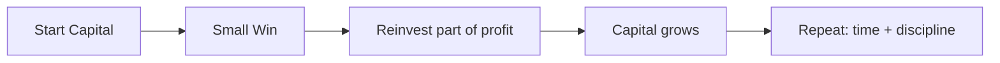
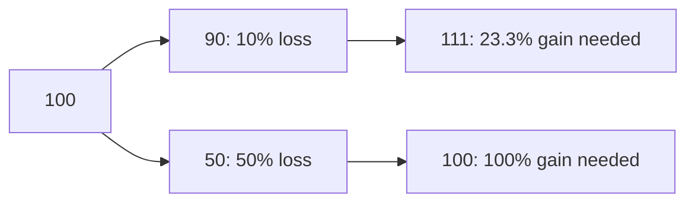
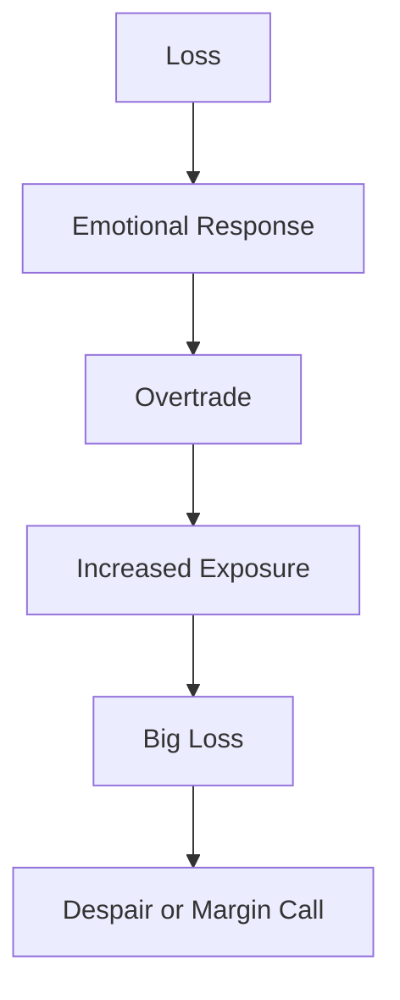

# RISK_MANAGEMENT_ADVANCED

## Товч зорилго
Энэхүү баримт бичиг нь эрсдлийг гүнзгий ойлгож, капиталыг хамгаалах, амьд үлдэх стратегийг боловсруулахад туслана. Бүх тайлбарууд энгийн, анхлан суралцагчдад зориулсан монгол хэлээр, англи нэр томьёо бүрд дуудлага, үндэс, монгол утга, энгийн тайлбар өгсөн байна.

---

## Яагаад эрсдэлийн удирдлага нь таамаглал (prediction)-аас илүү чухал вэ?
- Таамаглал нь зөв байж болно, гэхдээ маш их тохиолдолд буруу болно. Хэрэв та эрсдлийг удирдаж чаддаг бол хэдэн ч буруу таамаглал давтагдсан ч дансаа авран үлдэх боломжтой.
- Тогтвортой ашиг олж байвал зах зээлийн алдаа, угаас санамсаргүй байдал, эсвэл хувиарлалтаас үл хамаарна. Эцсийн зорилго: "Амьд үлдэх" → дараа нь "ашиг".

---

## Нийтлэг англи нэр томьёо (pronunciation / root / Монгол утга / энгийн тайлбар)

### Risk Management
- Дуудлага: *риск менежмент*
- Үндэс: "risk"=эрсдэл, "management"=удирдлага
- Монгол утга: эрсдэлийг хэмжиж, хязгаарлах үйл явц
- Энгийн тайлбар: Алдагдалаас урьдчилан сэргийлэх дүрэм, процесс

### Position Sizing
- Дуудлага: *позицион сайзинг*
- Үндэс: "position"=байрлал, "sizing"=хэмжээ тохируулах
- Монгол утга: арилжааны хэмжээ тогтоох
- Энгийн тайлбар: Нэг арилжаанд хэдэн хувь хөрөнгийг байрлуулахыг шийдэх дүрэм

### Drawdown
- Дуудлага: *дроудаун*
- Үндэс: "draw"=татах, "down"=доош
- Монгол утга: хамгийн их алдагдал/бууралт
- Энгийн тайлбар: Дансны өндөр цэгээс хамаагүй хамгийн их буурсан хувь

### Risk/Reward Ratio
- Дуудлага: *риск ривард рэшио*
- Үндэс: эрсдэл ба шагналын харьцаа
- Монгол утга: алдагдал-ашгийн харьцаа
- Энгийн тайлбар: Хэдэн төгрөг алдаж хэдэн төгрөг олохоор төлөвлөж байна гэдгийг харуулна.

### Expected Value
- Дуудлага: *экспектэд вэлюэ*
- Үндэс: магадлалтай дундаж ашиг
- Монгол утга: хүлээгдэж буй дундаж үр ашиг
- Энгийн тайлбар: Удаан хугацаанд нэг арилжаа давтагдвал та дунджаар ямар ашиг авахыг тооцно.

- Формул: $EV = p \times W - (1-p) \times L$
  - $p$ = Win Rate, $W$ = дунджаар олох хэмжээ, $L$ = дунджаар алдах хэмжээ

### Probability
- Дуудлага: *пробабилити*
- Үндэс: магадлалын ойлголт
- Монгол утга: боломжийн хэмжээ
- Энгийн тайлбар: Ямар нэг зүйл болох магадлал (0-1 эсвэл 0-100%)

### Win Rate
- Дуудлага: *вин рэйт*
- Үндэс: ялах тохиолдлын хувь
- Монгол утга: ялалт авалт бүрийн хэмжээ
- Энгийн тайлбар: Бүх арилжаанаас хэд нь ашигтай байгаа хувь

### Capital Preservation
- Дуудлага: *капитал презервашн*
- Үндэс: хөрөнгийг хадгалах
- Монгол утга: капитал хамгаалалт
- Энгийн тайлбар: Хамгийн чухал зорилго нь хөрөнгө барагдуулалгүй хадгалах

### Volatility
- Дуудлага: *волатилити*
- Үндэс: өөрчлөлт, савалгаа
- Монгол утга: үнэ хурдан хэлбэлзэх байдал
- Энгийн тайлбар: Илүү их волатил зах зээл нь их өөрчлөлт үүсгэдэг

### Exposure
- Дуудлага: *экспожэрэ*
- Үндэс: илчлэл, нээлт
- Монгол утга: зах зээлд илэрхийлж буй таны нийт байрлал
- Энгийн тайлбар: Та зах зээлд ямар хэмжээний мөнгө "холбосон" байгааг харуулна

### Diversification
- Дуудлага: *диверсификэйшн*
- Үндэс: төрөлжүүлэх
- Монгол утга: хөрөнгийг олон зүйлд хуваах
- Энгийн тайлбар: Нэг зүйл унасан ч бүх хөрөнгө доройтохгүйн тулд төрөлжүүлэх

### Correlation
- Дуудлага: *коррелейшн*
- Үндэс: хоёр хувьсагчийн харилцан хамаарал
- Монгол утга: нэг үнийн хэрхэн нөгөөтэйгээ холбоотой байгааг харуулна
- Энгийн тайлбар: Хэрэв хоёр актив ижил чиглэлд ихэвчлэн хөдөлдөг бол тэд өндөр корреляцтай

### Leverage
- Дуудлага: *левередж*
- Үндэс: "lever"=хүч, "-age"=үйл явц
- Монгол утга: өргөгч хүч, зээлийн хүч
- Энгийн тайлбар: Бага хөрөнгөөр илүү их байрлал авах арга

### Margin
- Дуудлага: *маржин*
- Үндэс: барьцаа
- Монгол утга: брокерт тавьсан барьцаа, баталгаа
- Энгийн тайлбар: Leverage ашиглахад шаардлагатай хөрөнгө

### Portfolio Risk
- Дуудлага: *портфолио риск*
- Үндэс: багцын эрсдэл
- Монгол утга: бүх активуудын нийлбэр эрсдэл
- Энгийн тайлбар: Нэг актив биш, нийт хөрөнгө хэр эмзэг вэ гэдгийг хэлнэ

### Kelly Criterion
- Дуудлага: *кэли критерион*
- Үндэс: нэр зохиогч John Kelly-н томьёо
- Монгол утга: оновчтой байрлалын хувь олдог томьёо
- Энгийн тайлбар: Илрүүлэх магадлал ба төлбөрийн харьцаагаар хэдэн хувь хөрөнгийг тавих ёстойг тооцно

- Формул: $$f^* = \frac{p( b + 1) - 1}{b}$$
  - $p$ = ялалтын магадлал, $b$ = дундаж ашиг / дундаж алдагдал (payoff ratio). Энэхүү томьёо нь хоёуланг нь тооцдог.

### Maximum Drawdown
- Дуудлага: *максимум дроудаун*
- Үндэс: хамгийн их бууралтын үзүүлэлт
- Монгол утга: дансны хамгийн их алдагдал
- Энгийн тайлбар: Дансны өндөр цэгээс хамгийн их унасан хувь

---

## Нутгийн тайлбар, гүнзгий ойлголт

### Risk Management (Дэлгэрэнгүй)
Эрсдэлийн удирдлага гэдэг нь хувь хүн эсвэл байгууллага арилжааны үр дагавар, алдагдлыг урьдчилан тооцож, хязгаарлах систем бий болгох.
- Үндсэн элемент: position sizing, stop loss, diversification, capital preservation, exposure control.
- Парадигм: "Risk first, profit second."

### Position Sizing (Дэлгэрэнгүй)
- Fixed fractional method: $Position = Capital \times f$, энд $f$ нь нэг арилжаанд эрсдэллэх хувь.
- Risk-per-trade method: $Position = \frac{Capital \times Risk\_per\_trade}{Stop\_distance}$
  - Жишээ: $Capital=10,000$ USD, $Risk\_per\_trade=0.01$ (1%), Stop distance=2% → $Position=\frac{10,000\times0.01}{0.02}=5,000$ USD.

"Аюулгүй" позицион vs "аюултай" позиционыг харах ерөнхий дүрэм: бага volatility, бат бөх stop, капиталад жижиг хувь бол аюулгүй.

### Drawdown (Дэлгэрэнгүй)
- Drawdown нь тухайн системийн амьдралд ямар хэмжээний сорилт ирэхийг харуулна.
- Recovery formula: хэрвээ таны данс $d$%-иар буурсан бол үүнээс сэргэхэд шаардлагатай өсөлт нь:

$$g = \frac{d}{1-d}$$

- Жишээ: $d=0.5$ (50% drawdown) → $g = 0.5/(1-0.5)=1 = 100\%$ өсөлт шаардлагатай.

### Risk/Reward Ratio
- Энгийн дүрэм: $RR = \frac{Average\ Win}{Average\ Loss}$.
- Хэдийгээр RR өндөр байх сайн боловч EV (expected value)-г тооцох хэрэгтэй: $EV = pW - (1-p)L$.

### Expected Value болон Probability
- EV-г мэдэж байж л систем нь ашигтай эсэхийг тодорхойлно. Жишээ: хэрвээ $p=0.4, W=2, L=1$ бол $EV = 0.4\times2 - 0.6\times1 = 0.2$ буюу 0.2 нэгж жишээ тутамд.

### Volatility болон Exposure
- Volatility ихтэй активуудад position sizing-ыг жижиг байлгах ёстой.
- Exposure нь нийт капиталд нээлттэй байрлалын хувь: $Exposure = \frac{Total\ Open\ Positions}{Capital}$.

### Diversification & Correlation
- Корреляц нь -1..+1 хооронд хэлбэлзэнэ. Хэрэв корреляц ойртох нь +1 бол төрөлжүүлэх ач холбогдол багасна.

### Leverage & Margin
- Leverage нь боломж болон эрсдэлийг томруулна: $PnL_{leveraged} = Leverage \times PnL_{unleveraged}$.
- Margin call-д хүрэх эрсдэлээс сэргийлэхийн тулд initial margin, maintenance margin-ыг ойлгох хэрэгтэй.

### Kelly Criterion (Дэлгэрэнгүй)
- Kelly нь оновчтой хувь олгох ба энэ нь өндөр зөрчилдөөнтэй тохиолдолд өндөр хувь санал болгодог. Хэт Kelly-г шууд дагах нь волатилити ихтэй системд аюултай.
- Практик зөвлөмж: Use fractional Kelly (e.g., 1/4 Kelly) to reduce volatility.

### Maximum Drawdown
- Portfolio-д maximum drawdown-г тогтоож, түүнээс давбал автомат shrinkage буюу position size-ыг бууруулах дүрэм тавих.

---

## Яагаад ихэнх арилжаачид эрсдэлийг дутуу үнэлдэг вэ?
- Short-term thinking: богино хугацааны үр дүнг илүүд үздэг.
- Overconfidence: өнгөрсөн амжилтыг ирээдүйн баталгаа гэж боддог.
- Social pressure: signal groups, media hype.
- Poor journaling: давтагдах алдааг харахгүй.

---

## Мэргэжилтнүүд хэрхэн урт хугацаанд амьд гардаг вэ?
- Capital preservation-first: drawdown-ыг хянах.
- Edge management: expectancy-д суурилсан стратеги.
- Risk limits: daily loss limits, position caps.
- Process focus: pre-trade plan, post-trade review.

---

## Drawdowns-ийн сэтгэл зүйн нөлөө
- Decision fatigue, avoidance, revenge trading, loss of confidence.
- Recovery plan: reduce size, take break, paper trade, peer review.

---

## Leverage-ийн аюул
- Leverage нь both amplifies wins and losses. Small price moves can wipe equity.
- Always stress-test leveraged positions: what if volatility doubles?

---

## Хөрөнгийг хамгаалж ирээдүйг хэрхэн бүтээдэг вэ
- Capital preservation нь дараа нь боломжтой тооцооллоо хэрэгжүүлэх хөрөнгийг өгдөг.
- Small steady wins compound: see Compounding diagram.

---

## Аз тоглоом (Gambling) болон хяналттай эрсдэлийн ялгаа
- Gambling: edge тодорхойгүй, expectation ихэвчлэн сөрөг.
- Controlled risk: edge тодорхой, EV-ийг тооцсон, position sizing-тай.

---

## Байгууллагууд exposure-ыг хэрхэн удирддаг вэ
- VaR (Value at Risk), stress tests, limits by desk, hedging, collateral management.
- Institutional процедур: pre-trade approval for large tickets, daily risk reports.

---

## Яагаад сайн стратеги ч эрсдэлийн удирдлагагүй бол бүтэлгүйтдэг вэ
- Strategy нь зөв байж болно, гэхдээ хэрэв risk control байхгүй бол нэг муу үе системийг устгадаг.

---

## Маркдаун хүснэгтүүд

### Аюулгүй vs Аюултай position sizing

| Зарчим | Аюулгүй | Аюултай |
|---|---|---|
| Risk per trade | 0.25% - 1% | >2% |
| Volatility adjustment | Дагах | Үл тоомсорлох |
| Stop placement | logical, technical | arbitrary эсвэл байхгүй |
| Capital impact | бага, тогтвортой | өндөр, асар их drawdown боломжтой |

---

### Сэтгэл хөдлөлтэй арилжаа vs Магадлалд тулгуурлах бодлого

| Шинж | Сэтгэл хөдлөлтэй | Магадлалд тулгуурласан |
|---|---|---|
| Оролт | impulsiв, FOMO | pre-defined_signal, evidence-first |
| Exit | паник эсвэл горилох | stop loss болон target мэдэгдсэн |
| Журнал | ховор | өдөр тутмын бичлэг |
| Position size | өөрийн мэдэлд | volatility-ээр тохируулсан |

---

### Анхан шатны зан төлөв vs Байгууллагын зан төлөв

| Зөвшил | Анхан шат | Байгууллага |
|---|---|---|
| Decision making | хувь хүний мэдрэмж | процесс, desk approval |
| Risk limits | төдийлөн тодорхойгүй | хатуу дүрэм, VaR, margin |
| Leverage use | хэтрүүлсэн | хянасан, stress-tested |

---

## Диаграммууд

### Compounding growth (сэргээх ба өсөлт)

### Drawdown recovery difficulty

### Risk spiral after emotional losses

---

## Практик дасгалууд

### Personal risk limit worksheet
- Capital: ___________
- Max drawdown allowed (%): ___________
- Risk per trade (%): ___________
- Max simultaneous exposure (% of capital): ___________
- Daily loss limit: ___________
- Action if daily loss limit hit: (e.g., stop trading for 24 hours)

### Daily exposure checklist
- Total open exposure \(\%\) = _______ (should be < Max exposure)
- Largest position \(\%\) = _______ (should be < max per position)
- Margin usage: _______ (keep buffer for volatility)
- Any correlated positions? yes/no -> list:

### Emotional risk review (daily)
- Mood before trading: _______
- Trigger events today: _______
- Any revenge trading urge? Y/N
- Was stop loss obeyed? Y/N

### "What if I lose 10 trades in a row?" exercise
1. Assume capital $C$ and risk per trade $r$ (decimal). After 10 straight losses, remaining capital:

$$C_{after} = C(1 - r)^{10}$$

2. Example: $C=10,000$, $r=0.01$ (1%) → $C_{after}=10,000(0.99)^{10} \approx 9,048$ (≈9.5% loss).
3. If $r=0.03$ (3%) → $C_{after}=10,000(0.97)^{10} \approx 7,367$ (≈26.3% loss).
4. Дүгнэлт: Risk per trade-ыг бага байлгах нь олон дараалсан алдагдалд тэсвэрлэхэд чухал.

---

## "How professional traders think in probabilities"
- Мэргэжилтнүүд хувьцаа нэг бүр дээр түүний магадлал, боломж, volatility-г тооцож шийддэг.
- Тэд EV, Kelly, win rate-ыг анхаардаг; мөн volatility-ээр position-оо тохируулдаг.
- Тухайн шийдвэр бол магадлалын шийдвэр: "энэ арилжаа давтагдвал 1000 удаа хийгдсэн тохиолдолд дунджаар надад ашигтай юу?"

---

## "Why survival is the real edge"
- Амьд үлдэх нь дараагийн боломжийг авдаг. Хэрэв та дансаа алдвал бас дахин эхлэхэд хөрөнгө, цаг алдана.
- Survival гэдэг нь хуруу зөрөхгүйгээр тогтмол, бага алдагдалтай байж, боломж гарвал ашиг авах чадвар юм.

---

## Дүгнэлт
Эцсийн зорилго: системтэй, магадлалд тулгуурласан, капитал хамгаалах стратеги. Таамаглал зөв байж болно, гэхдээ зөв эрсдэлийн удирдлагагүй бол урт хугацаанд амжилт олохгүй.

---

## Ашигтай эх сурвалж
- John C. Hull — Risk Management
- Howard Marks — The Most Important Thing
- Наастай баримт бичгүүд: PROJECT_CORE.md, GLOSSARY.md, RISK_POLICY.md
