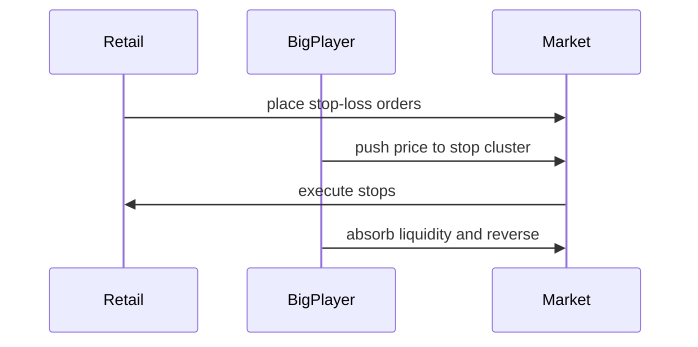
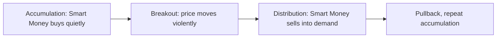

# SMART_MONEY

## Төслийн зорилго
Энэхүү баримт бичиг нь "Smart Money" (ухаалаг мөнгө) гэж юу болох, институц, маркет-мейкер, том тоглогчдын зан төлөвийг эхлэгчдэд ойлгомжтой монгол хэлээр тайлбарлахад зориулагдсан. Бүх англи нэр томьёонд дуудлага, үндэс, монгол утга, энгийн тайлбар оруулсан.

---

## "Smart Money" гэж юу вэ?
- Дуудлага: *смарт мани*
- Үндэс: "smart"=ухаантай, "money"=мөнгө
- Монгол утга: зах зээлд нэр хүндтэй, их хэмжээний хөрөнгө хөдөлгөдөг мэргэжилтэн буюу институцын хөрөнгө
- Энгийн тайлбар: Их хэмжээний, стратегитай, зах зээлийг хөдөлгөх чадвартай хөрөнгө. Институц, хедж сан, банк, маркет мейкер зэрэг оролцогчид ихэвчлэн "smart money" гэж тооцогддог.

Ухаалаг мөнгө нь урт хугацааны процесс, execution, хеджинг, liquidity-ийг ашиглах аргууд дээр тулгуурлана — тэд индикатор биш, order flow, position-ийг илүү харж ажиллана.

---

## Тухайн нэр томьёонууд (pronunciation / root / Монгол утга / энгийн тайлбар)

### Institutional Capital
- Дуудлага: *институшинал капитал*
- Үндэс: "institutional"=байгууллагын, "capital"=хөрөнгө
- Монгол утга: институцийн эзэмшиж буй хөрөнгө
- Энгийн тайлбар: Банк, хедж сан, хөрөнгө оруулалтын сангийн хувьд том хэмжээний мөнгө.

### Market Maker
- Дуудлага: *маркет мэйкер*
- Үндэс: "market"=зах зээл, "maker"=хийгч
- Монгол утга: үнэ тогтворжуулах үүрэгтэй шалгагч оролцогч
- Энгийн тайлбар: Худалдан авагч ба зарагч талд захиалга байршуулаад spread-ээр ашиг олдог байгууллага.

### Liquidity Grab
- Дуудлага: *ликвидити граб*
- Үндэс: "liquidity"=хөрвөх чадвар, "grab"=авах
- Монгол утга: зах зээлээс олонтой захиалгыг цэвэрлэх үйл ажиллагаа
- Энгийн тайлбар: Том ордер эсвэл манипуляциар жижиг оролцогчдын stop-уудыг идэх үйлдэл.

### Stop Hunt
- Дуудлага: *стоп хант*
- Үндэс: "stop"=зогсоох алдагдал, "hunt"=ан хийх
- Монгол утга: жижиг трейдерүүдийн stop loss-ыг зориудаар цэвэрлэх
- Энгийн тайлбар: Үнэ түр зуур эргэж, олон stop-ыг идсэн дараа буцаад үндсэн чиглэлийг үргэлжлүүлдэг.

### Order Flow
- Дуудлага: *ордер флоу*
- Үндэс: "order"=захиалга, "flow"=урсгал
- Монгол утга: захиалгын урсгал, гүйцэтгэлүүдийн хөдлөл
- Энгийн тайлбар: Хаашаа их мөнгө орж буйг харуулах шууд дохио.

### Accumulation
- Дуудлага: *акьюмьюлейшн*
- Үндэс: "accumulate"=хуралдуулах
- Монгол утга: том тоглогчид удаан хугацаанд худалдан авч байгааг харуулсан үе
- Энгийн тайлбар: Үнэ бага байхад аажмаар байрлуулж байгаа процесс.

### Distribution
- Дуудлага: *дистрибьюшн*
- Үндэс: "distribute"=тарих
- Монгол утга: том тоглогчид алга болон зарах үйл явц
- Энгийн тайлбар: Үнэ өндөр байх үед байрлалаа аажмаар борлуулж эхэлдэг үе.

### Manipulation
- Дуудлага: *манипулэйшн*
- Үндэс: control, alter
- Монгол утга: зах зээлийн үнэ болон сэтгэгдлийг зориудаар нөлөөлөх үйлдэл
- Энгийн тайлбар: Том тоглогчид жижиг оролцогчдыг "гаргах" зорилготой хөдөлгөөн үүсгэх.

### Break of Structure (BoS)
- Дуудлага: *брэйк оф стркчр*
- Үндэс: бүтцийн эвдрэл
- Монгол утга: зах зээлийн бүтэц (higher highs/lows) эвдрэх үйлдэл
- Энгийн тайлбар: Trend-ийн үндсэн логик өөрчлөгдөж, шинэ чиглэл үүсэх дохио.

### Fair Value Gap (FVG)
- Дуудлага: *фэйр вэлю гэп*
- Үндэс: үнэ ба боломжийн үнэ хоорондын нэрмэл зай
- Монгол утга: зах зээлийн тэнцвэргүй байдлын цэг
- Энгийн тайлбар: Тохиромжгүй гүйцэтгэлээс үүдэж үүссэн зөрүү; price нь ихэвчлэн энэ зайг нөхөх гэж буцаана.

### Imbalance
- Дуудлага: *имбэлэнс*
- Үндэс: тэнцвэргүй байдал
- Монгол утга: худалдан авагч ба зарагчийн тэнцвэр алдагдсан байдал
- Энгийн тайлбар: Том тухайн талын захиалга давамгайлж үнэ хурдан хөдөлдөг үе.

### Premium and Discount
- Дуудлага: *премиум ба дискаунт*
- Үндэс: үнэ зах зээлийн жижгийг давсан/доорхи байдал
- Монгол утга: өндөр үнэ (premium) ба хямд үнэ (discount)
- Энгийн тайлбар: Зах зээл аль хэсэгт голлохыг харуулна: институц нь ихэвчлэн премиум дээр зарах дуртай.

### Session Liquidity
- Дуудлага: *сешн ликвидити*
- Үндэс: тодорхой худалдааны сессийн доторх liquidity
- Монгол утга: тухайн цагийн бүс доторх худалдааны гүйцэтгэлүүдийн эрчим
- Энгийн тайлбар: Хөрөнгийн зах зээлийн хамгийн их идэвхтэй цагууд (session highs) нь илүү их liquidity өгдөг.

### Market Narrative
- Дуудлага: *маркет наратив*
- Үндэс: "narrative"= өгүүллэг
- Монгол утга: зах зээлийг удирдах домог, тайлбар, хэв маяг
- Энгийн тайлбар: Мэдээлэл, мэдээ, analyst-ийн өгүүлэл зэрэг нь олон хүнийг зэрэг чиглүүлдэг.

### Positioning
- Дуудлага: *позиционинг*
- Үндэс: байр суурь эзлэх үйлдэл
- Монгол утга: оролцогчдын нийт байрлалуудын чиг хандлага
- Энгийн тайлбар: Хүмүүс аль тал дээр суурьтай вэ гэдгийг харуулна; net positioning нь дараагийн хөдөлгөөнийг тодорхойлно.

---

## Илүү нарийвчилсан хэсгүүд

### How institutions move large money
Институцүүд их хэмжээний ордерыг жижиг нь жижиг хэсгүүдээр, олон бирж, dark pools, algorithms ашиглан гүйцэтгэдэг.
- Execution tactics: TWAP, VWAP, iceberg orders, dark pool execution.
- Hedging: байрлалыг устгах, опционыг ашиглах.
- Timing: liquidity-rich sessions (session open/close) болон news windows-ыг ашиглах.

Эдгээр аргууд нь том ордерыг гүйцэтгэхдээ зах зээлийг доголдуулахгүйгээр хийх зорилготой.

---

### Why price seeks liquidity
- Үнэ ихэвчлэн том ордеруудыг гүйцэтгэхийн тулд эсрэг тал хайдаг.
- Stop clusters, bid/ask gaps нь том худалдааны гүйцэтгэлийг хялбарчилна.
- Price нь short-term-д «liquidity nodes» руу түр ханддаг, тэндээс дахин өөр чиглэлд хөдөлдөг.

Энэ учраас retail traders ихэвчлэн exit liquidity болдог — тэд stop-ууд руу байрлаж, том ордерууд тэдний захиалгыг цэвэрлэх үед гарч ирдэг.

---

### How retail traders become exit liquidity
- Жижиг трейдерүүд stop loss-ыг ижил түвшинд байрлуулж cluster үүсгэнэ.
- Том тоглогчид эдгээр цэгүүд рүү үнэ түлхэж, stop-уудыг эвдэлсний дараа буцаан гол чиглэлийг үргэлжлүүлдэг.
- Retail traders-ийн мэдлэг, execution capacity-гүйгээс тэд ихэвчлэн орж, дараа нь зах зээлийн ховх шугаманд гардаг.

---

### Why beginners focus on indicators while professionals focus on liquidity
- Indicators нь өнгөрсөн өгөгдөл дээр тулгуурласан derived signal-ууд — заримдаа хүний сэтгэл зүйн хөдөлгөөнийг хоцруулж заана.
- Professionals order flow, volume profile, tape reading (level 2/DOM) дээр тулгуурлана — тэд зах зээлийн "ямар хүмүүс хаана зогсож байгааг" шууд харж чадна.
- Indicator-ыг үзэж буй retail нь олон нийттэй ижил дохиог авдаг тул exit liquidity-д амархан ордог.

---

### Institutional psychology vs retail psychology
- Institutional: process-driven, risk-managed, execution-focused, confidential.
- Retail: emotion-driven, overconfident, public, индикатор-д тариалж хамаарна.

Институцийн пирсүүд хэзээ яаж орж гарсныг хуваалцдаггүй, харин retail нь олон нийтийн форум, social media-с санаа авч шууд дагана.

---

### Why manipulation exists in markets
- Зарим зах зээл хэсэг нь хангалттай зохицуулалтгүй, liquidity бага байдаг → боломж гарна.
- Том тоглогчид өөрсдийн стратегийг хамгаалахын тулд зах зээлийг түр хугацаанд нөлөөлж, beneficial execution-ыг бий болгодог.
- Бүх манипуляци хууль зөрчихгүйгээр, зөвхөн execution болон зохион байгуулалтын аргаар явагддаг тохиолдлууд олон.

---

### How narratives are used to move crowds
- Новел, мэдээ, аналітик тайлбарууд crowd-ыг чиглүүлж, FOMO үүсгэдэг.
- Narrative нь retail attention-ийг татдаг; институцүүд энэ анхаарлыг ашиглан байрлалаа алга болгодог.
- Narrative tracking exercise-ээр та "юу хүмүүс ярьж байна" гэдгийг харж, дараа нь liquidity болон position-оор бодит үйлдлийг жишиж болно.

---

### How smart money hides positions
- Iceberg orders: том захиалгын хэсгийг зах зээл дээр харуулаад нууцалдаг.
- Dark pools: ил харагддаггүй гүний гүйлгээ.
- Split orders: том ордеруудыг жижиг хэсгүүдэд хувааж олон биржид тараах.
- Options delta hedging: дериватив ашиглан байрлалыг mask хийх.

Эдгээр нь ихэвчлэн retail-level observation-оор шууд харагдахгүй учир, order flow, volume spikes, session behavior-ыг нь харах хэрэгтэй.

---

## Markdown хүснэгтүүд

### Retail thinking vs Institutional thinking

| Үзэл баримтлал | Retail | Institutional |
|---|---|---|
| Төлөвшил | Indicator-driven | Liquidity & execution-driven |
| Risk | Emotional, often undefined | Processed, limits and hedges |
| Transparency | Public signals, discussion boards | Confidential, algorithmic orders |
| Timeframe | Short-term, quick wins | Multi-day to multi-year |

---

### Emotional trading vs Strategic positioning

| Шинж | Emotional trading | Strategic positioning |
|---|---|---|
| Оролт | Impulse, FOMO | Planned, scaled entries |
| Exit | Panic or ego-driven | Stop, target, hedging |
| Size | Oversized or all-in | Gradual, hedged |
| Focus | Immediate gain | Execution cost & liquidity |

---

### Smart money behavior vs Crowd behavior

| Үзэгдэл | Smart money | Crowd |
|---|---|---|
| Order size | Large, split | Small, clustered |
| Visibility | Hidden (dark pools, iceberg) | Public (retail orders) |
| Reaction to spikes | Use as execution opportunity | Chase and FOMO |
| Objective | Edge through execution | Quick profits, often emotional |

---

## Диаграммууд

### Liquidity sweep

### Stop hunt example

### Accumulation → Breakout → Distribution cycle

---

## Практик дасгалууд

### Daily liquidity mapping
- Өдөр бүр нэг график дээр: session highs/lows, visible liquidity pools, stop clusters-г тэмдэглэ.
- Volume spikes-г тэмдэглэж, тэдгээрийг institutional activity-тай холбон хар.

### Identifying stop clusters
- Support/Resistance-ийн дор жижиг хэмжээтэй зөвшилцсөн stop-уудыг хай.
- Хэрвээ олон жижиг ордер ижил түвшинд төвлөрсөн бол тэд stop cluster болно.

### Observing fake breakouts
- Breakout-ыг volume, order flow, session context-ээр шалга.
- Fake breakout-д ихэнхдээ volume бага ба price backfill хийнэ.

### Narrative tracking exercise
- Нэг сэдвийн (мэдээ, шинжилгээ) дор social media-с 7 хоногийн data цуглуул: юу ярьж байна, хэн, ямар сэтгэгдэлтэй.
- Дараа нь price болон liquidity activity-г харьцуул.

---

## How to study smart money concepts safely as a beginner
- Start with observation: paper trade liquidity events before risking real capital.
- Avoid leverage while learning execution and order flow.
- Use small size and strict stops; log every observation.
- Prefer learning from primary sources: exchange data, level 2, volume profile, not paid guru signals.
- Build a checklist: session liquidity, stop clusters, order flow confirmation.

---

## Common misunderstandings about smart money
- "Smart money always wins" — буруу; тэд ч алдаж болно, гэхдээ execution-д илүү анхаардаг.
- "If institutions buy, price will always go up" — заримдаа тэд accumulation хийж байхад price sideways байж болно.
- "Smart money equals manipulation" — зарим тохиолдолд тактик ашигладаг боловч бүх институц манипуляци хийдэггүй.

---

## Warning: Fake gurus and misuse of 'smart money'
- Зарим гуру "smart money" нэр томьёог маркетинг, hype-д ашиглаж, таныг copy trade, signal group руу татаад ашиг олдог.
- Харгалзах шалгуур: тэдний track record, execution transparency, risk disclosure-гүй бол болгоомжтой бай.
- Rule: сурсан зүйлээ paper trade хийж өөрөө шалга.

---

## Дүгнэлт
"Smart Money" гэдэг нь зах зээлийн том оролцогчдын execution, liquidity-т төвлөрсөн үзэл баримтлал юм. Эхлэгчид индикатор руу их хандах үед институцүүд order flow, position, liquidity-г ашиглана. Энэ мэдлэгийг аажмаар, paper trading-ээр, бага exposure-оор сурах нь хамгаалалттай.

---

## Ашигтай эх сурвалж
- Market microstructure ном, Level 2 хийцийн тайлбар.
- Order flow analysis tutorials, volume profile guides.
- PROJECT_CORE.md, LIQUIDITY.md, RISK_MANAGEMENT_ADVANCED.md
