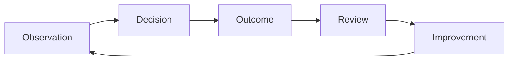
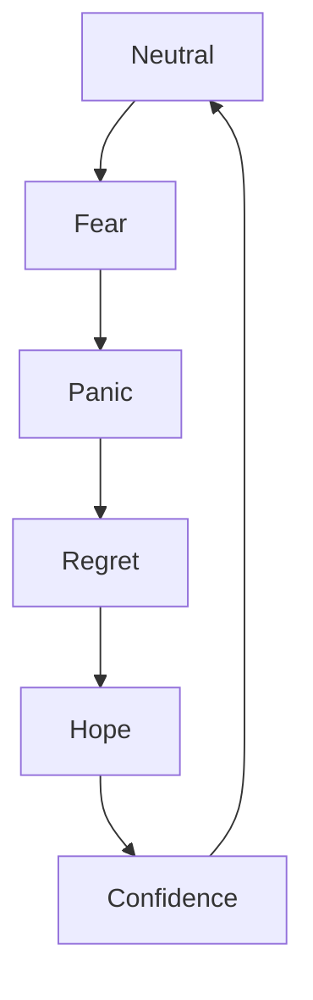

# TRADING_JOURNAL_SYSTEM

## Төслийн зорилго
Энэхүү баримт бичиг нь трейдэрүүдийн хамгийн чухал туслах хэрэгсэл болох журнал бичих системийг эхлэгчдэд ойлгомжтой, монгол хэл дээр тайлбарлахад зориулагдсан.

---

## Яагаад журнал бичих нь трейдэрүүдэд хамгийн чухал хэрэгсэл вэ?
- Журнал нь таны шийдвэр, сэтгэл хөдлөл, үр дүнг баримтжуулж, давтагдах боломжгүй тохиолдлуудыг илрүүлэхэд тусална.
- "Price is not truth. Price is expectation." гэдэг төсөлд байгаа философийн дагуу журнал нь таамаглал бус нотолгоо дээр суурилсан суралцлыг дэмждэг.
- Тогтмол журнал бичих нь алдаагаа давтахгүй байх, зөв дадал бий болгох, үргэлжлүүлэн сайжрах feedback loop-ыг бүрдүүлдэг.

---

## Гол нэр томьёонууд (pronunciation / root meaning / Монгол утга / энгийн тайлбар)

### Trading Journal
- Дуудлага: *трейдинг журнэл*
- Үндэс: "trading"=арилжаа, "journal"=тэмдэглэл
- Монгол утга: арилжааны тэмдэглэл
- Энгийн тайлбар: Таны арилжаа, ажиглалт, сэтгэл хөдлөлийн бүртгэл.

### Feedback Loop
- Дуудлага: *фийдбэк луп*
- Үндэс: "feedback"=сэтгэл ханамж, "loop"=мөргөлдөөн
- Монгол утга: итгэл шалгах давталт
- Энгийн тайлбар: Дүрэм дагаж үйлдэл хийсний дараа үр дүнг шалгаж, засварлах мөчлөг.

### Self-Awareness
- Дуудлага: *сэлф-аварнесс*
- Үндэс: өөрийгөө ухамсарлах
- Монгол утга: өөрийн мэдрэмжийг таних чадвар
- Энгийн тайлбар: Би яагаад ийм шийдвэр гаргаснаа ойлгох.

### Pattern Recognition
- Дуудлага: *пэттерн рекогнишн*
- Үндэс: хэв маягийг таних
- Монгол утга: давтагдах хэлбэрийг харах чадвар
- Энгийн тайлбар: График, зан төлөвт харсан ижил төстэй хэв маягийг олж таних.

### Emotional Logging
- Дуудлага: *эмоушнэл логгинг*
- Үндэс: үзэл бодол, бүртгэх
- Монгол утга: сэтгэл хөдлөл бичих
- Энгийн тайлбар: Таны арилжааны үед ямар мэдрэмжтэй байснаа тэмдэглэх.

### Performance Tracking
- Дуудлага: *перформанс трэкинг*
- Үндэс: гүйцэтгэлийг хянах
- Монгол утга: гүйцэтгэлийг тоолж хугацааны явцад харж байх
- Энгийн тайлбар: Ашиг, алдагдал, win rate-г тэмдэглэх.

### Habit Formation
- Дуудлага: *хабил формэйшн*
- Үндэс: зуршил үүсгэх
- Монгол утга: дадал хэвшил бий болгох
- Энгийн тайлбар: Журнал бичихийг тогтмол зуршил болгох.

### Process vs Outcome
- Дуудлага: *процесс вс ауткам*
- Үндэс: үйл явц ба үр дүн
- Монгол утга: замнал ба эцсийн үр дүнгийн ялгаа
- Энгийн тайлбар: Таны хийсэн үйл явц сайн байсан ч үр дүн түр зуур буруу байж болно.

### Review System
- Дуудлага: *ривью систем*
- Үндэс: шалгах систем
- Монгол утга: дүгнэлт хийх систем
- Энгийн тайлбар: Өмнөх арилжаа, сэтгэл хөдлөл, алдааг эргэн харж сурах процесс.

### Behavioral Analysis
- Дуудлага: *бихэйвиорал анализис*
- Үндэс: зан үйл шинжлэх
- Монгол утга: өөрийн зан төлөвийг судлах
- Энгийн тайлбар: Таны арилжааны үед ямар сэтгэл хөдлөл, дадал гарч байгааг судална.

---

## Яагаад ихэнх трейдэрүүд журнал бичихээс зайлсхийдэг вэ?
- Журнал бичих нь цаг авдаг, ажил ихтэй мэт санагддаг.
- Алдаа, эвгүй сэдвийг хармааргүй байх байр суурь байдаг.
- Тэдгээр нь "ажиллах" биш, зөвхөн "авах" гэж боддог болдог.
- Илэрхий үр дүн алга, эсвэл бичсэн зүйлээ ашиглаж чадахгүй мэт санагддаг.

---

## Мэргэжилтнүүд журналыг хэрхэн ашигладаг вэ?
- Тэд орон зай, үнэ, execution cost, сэтгэл хөдлөл, decision logic-ыг бүгдийг нь тэмдэглэдэг.
- Долоо хоног, сар болгон review хийж, хэв маяг, алдаа, сайжруулах цэгийг олдог.
- Тэд "process-first" үзэл баримталж, өдрийн шинжлэлээс илүү нийт системдээ анхаардаг.
- Журнал нь тэдэнд feedback loop-ыг бий болгож өгдөг.

---

## Яагаад ой санамж найдвартай биш вэ?
- Бид буруу хугацааг, олон зүйл төлөвлөж байсан мэт санах хандлагатай.
- Эмоц нь тухайн мөчид илүү том, бусад деталиг дараад байдаг.
- Алдагдалд орсны дараа бид бурууг гүйцэд төсөөлж, үнэн зөвийг мартдаг.
- Тиймээс "санах" биш, "бичиж" хадгалах нь илүү зөв.

---

## Алдагдлын дараах сэтгэл хөдлөл хараагүй байх
- Алдагдал авсан үед бид ихэвчлэн шоконд орж, сэтгэл хөдлөл маань улам бүр жижиг деталиг нүдээр үзэхгүй болгодог.
- Энэ үе нь revenge trading, panic exit, эсвэл дэндүү өөртөө итгэх зэрэгт хүргэдэг.
- Журнал нь тэр мэдрэмжийг бичиж, дараа нь ариун сэтгэлээр эргэн харж болох боломжийг өгдөг.

---

## Журнал бичих нь сахилга бат сайжруулдаг учир
- Тогтмол бичих нь өдрийн эрэмбийг тодорхойлж, алдаануудаа системтэйгээр засдаг.
- Шаардлагагүй оролцоог багасгаж, зөвхөн predefined system-д баригдана.
- Өдөрт нэг удаа "би яагаад ийм шийдвэр гаргав" гэж асууж, арилжааныхаа хөдөлгөгч хүчин зүйлсийг танина.

---

## Яагаад алдааг хянах нь чухал вэ?
- Алдааг харсны дараа л дахиад давтахгүй байх боломжтой.
- Журналгүй хүмүүс нэг алдааг олон удаа давтардаг.
- Мөрдөхгүй зүйлийг сайжруулах боломжгүй.

---

## Хэрхэн зан төлөвийн хэв маяг давтагддаг вэ?
- Жижиг арилжаачид ихэвчлэн ижил нөхцөлд ижил мэдрэмж гаргадаг: FOMO дээр орж, stop loss-оо хүрэхгүй байрлуулж, алдаагаа нөхөх гэж оролддог.
- Журнал нь эдгээр давтагдах хэв маягийг баримтжуулдаг.
- Давтагдсан хэв маягийг олсноор та системийг өөрчилж болно.

---

## Яагаад процесс нь ганц үр дүнгээс илүү чухал вэ?
- Нэг арилжаа ашигтай байгаад ч процесс нь буруу байж болно; эргээд илүү олон арилжаа алдагдалтай байж болно.
- Сайтар баримтжуулсан процесс нь урт хугацааны edge-ийг бүрдүүлдэг.
- "Outcome" нь санамсаргүй байж болно, харин "Process" нь давтагдах боломжтой.

---

## Детайлтай Markdown загварууд

### Daily market observation / Өдрийн зах зээлийн ажиглалтын форм
- Огноо: __________
- Зах зээлийн ерөнхий чиглэл: __________
- Гол тухайн өдөр баар: support/resistance, breakout, fake breakout:
- Session context: __________
- Liquidity мөн: __________
- Өөрийн мэдрэмж, сэтгэл хөдлөл: __________
- Хоорондын харилцаа: bear/bull, risk-on/risk-off: __________
- Өнөөдрийн гол асуулт: __________
- Дүгнэлт: __________

### Trade idea log / Арилжааны санааны бүртгэл
- Арилжааны төрөл: Long / Short / Range
- Учир шалтгаан: __________
- Entry нөхцөл: __________
- Stop loss: __________
- Target: __________
- Position sizing: __________
- Edge: __________
- Decision logic: __________
- Стратеги дагаж мөрдөв үү?: __________
- Таамаглал vs доказ: __________

### Emotional state log / Сэтгэл хөдлөлийн тэмдэглэл
- Өглөөний сэтгэл: __________
- Trade өмнөх сэтгэл: __________
- Trade үед мэдэрсэн: __________
- Trade дараа сэтгэл: __________
- Fear / Greed / FOMO / Panic / Confidence: __________
- Энэ сэтгэл миний шийдвэрт хэрхэн нөлөөлөв?: __________
- Өнөөдөр юу өөрчлөх вэ?: __________

### Weekly review / Долоо хоногийн дүн шинжилгээ
- Гол ялалт: __________
- Гол алдаа: __________
- Хэр их discipline барив: __________
- Process юу байсан бэ?: __________
- Pattern-ууд: __________
- Дараагийн долоо хоногт анхаарах зүйл: __________

### Monthly review / Сарын тойм
- Нийт ашиг/алдагдал: __________
- Win rate: __________
- Дундаж алдагдал/ашиг: __________
- Хамгийн том lesson: __________
- Хэзээ сахилга бат алдагдсан бэ?: __________
- Ирэх сарын зорилго: __________

### Mistake analysis / Алдааны шинжилгээ
- Алдааны төрөл: __________
- Ямар нөхцөлд болсон бэ?: __________
- Би ямар мэдрэмжтэй байсан бэ?: __________
- Ямар дүрэм зөрчсөн бэ?: __________
- Ямар зүйлийг дараа нь өөрчлөх вэ?: __________
- Энэ алдааг хэрхэн task-д хуваах вэ?: __________

### Psychology tracking / Сэтгэл зүйн мөрдлөг
- Илүү их FOMO байсан уу?: __________
- Revenge trading-т автагдсан уу?: __________
- Panic selling хийгээгүй юу?: __________
- Эмоцийн хамгийн том үүр: __________
- Өөрийгөө тайвшруулах ямар арга хэрэглэсэн бэ?: __________

### Risk review / Эрсдэлийн хяналт
- Хамгийн их алдагдалтай trade: __________
- Stop loss-ыг би баримтлав уу?: __________
- Position sizing угтаа зөв байв уу?: __________
- Total exposure: __________
- Daily loss cap хэтрүүлсэн үү?: __________
- Хэрхэн реактив биш, төлөвлөгөөтэй байв?: __________

### Lesson learned log / Суралцсан зүйлсийн тэмдэглэл
- Өнөөдрийн хамгийн чухал lesson: __________
- Ямар дүрмийг батлах ёстой вэ?: __________
- Ямар шинэ observation гарсан бэ?: __________
- Дахин давтагдах сэдвүүд: __________

---

## Markdown хүснэгтүүд

### Emotional vs disciplined journaling

| Үзүүлэлт | Emotional journaling | Disciplined journaling |
|---|---|---|
| Төвлөрөл | Мэдрэмж, бодит бус | Process, data |
| Тогтмол байдал | Ховор бичлэг | Өдөр бүр бичлэг |
| Шинжилгээ | Дур мэдэн | Системтэй, predefined questions |
| Алдааг засах | Түр зуур | Урт хугацааны сайжруулалт |

---

### Good review habits vs destructive habits

| Шинж | Good review habits | Destructive habits |
|---|---|---|
| Focus | Process first | Outcome only |
| Feedback | Regular, concrete | Irregular, vague |
| Emotional check | Yes | No |
| Learning | Clear action items | Just blame |

---

## Диаграммууд

### Observation → Decision → Outcome → Review → Improvement loop

### Emotional cycle tracking

---

## Практик дасгалууд

### 7-day observation challenge
- 7 хоногт өдөр бүр зах зээлийн ажиглалтаа бич.
- Wave, liquidity, сэтгэл хөдлөл, decision logic-ыг тэмдэглэ.
- 7 дахь өдөр review хийж, таньдаг patterns-ийг жагсаа.

### Emotional awareness exercise
- Арилжааны өмнө, дунд, дараа сэтгэл хөдлөлөө 1-5 оноогоор үнэл.
- Fear, greed, confidence, impatience гэж бич.
- Хэрэв 4-5 гарч байвал шийдвэрээ дахин шалга.

### Pattern tracking exercise
- Өдөр бүр 1-2 pattern олж тэмдэглэ: FOMO entry, revenge trade, stop hunts.
- Давтагдсан бол "pattern" гэж тэмдэглэ.
- Долоо хоногийн review дээр pattern-уудыг шалга.

### Self-review checklist
- Би predefined rules-ээ мөрдсөн үү?
- Ямар мэдрэмж намайг удирдав?
- Миний decision логик баримттай юу?
- Ямар 1 зүйл дараа сайжруулах вэ?
- Энэ арилжаа процесс өндгөн эсэхийг яаж шалгах вэ?

---

## "How journaling builds long-term edge"
- Журнал нь таны давтагдах хэв маягийг илрүүлж, бага алдааны давтамжийг багасгалдаг.
- Эмпирик (observed) lessons-ийг тоолж, системгүй арилжаа биш системтэй арилжаа болгодог.
- Edge нь зөвхөн сигнал биш, мөн процесс, discipline, learning cycle-н нийлбэр.

---

## "What professionals review after losses"
- Rule breach: stop loss зөрчсөн, position sizing буруугүй эсэх.
- Execution: entry/exit timing, slippage, spread.
- Emotion: fear, hope, revenge trading, impatience.
- Context: market structure, liquidity, news, macro.
- Lesson: дараа нь ямар дэлгэрэнгүй action авах вэ.

---

## "How to use journals without real-money trading"
- Paper trading-ээр entry/exit-үүдийг баримтжуул.
- Simulation, backtesting, demo account ашиглан журналаа бич.
- Хэвшмэл арга барилуудыг chart study дээр тэмдэглэ.
- Реал мөнгөний дарамтгүйгээр сэтгэл зүйн pattern-уудыг анхаар.

---

## Дүгнэлт
Журнал бичих нь трейдэрийн хамгийн хүчтэй туслах юм. Энэ нь зөвхөн алдааг илрүүлэхээр зогсохгүй, процессийг боловсруулж, long-term edge-ийг бий болгодог. Эхлэгчдэд журнал нь мэдлэгээ нэмэх, зан төлөвөө ойлгох, зах зээлийн системтэй ажиллах хамгийн сайн хэрэгсэл юм.
