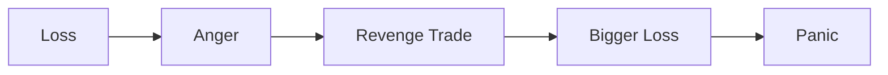

# TRADING_MISTAKES

## Төслийн зорилго
Энэхүү баримт бичиг нь арилжаачдын хамгийн нийтлэг алдаануудыг (trading mistakes) эхлэгчдэд ойлгомжтой хэлбэрээр тайлбарлаж, хэрхэн сэрэмжлэх, засах аргыг сургамж болгох зорилготой. `PROJECT_CORE.md`, `MARKET_PSYCHOLOGY.md`, `LIQUIDITY.md`, `PENNY_STOCKS.md`, `HISTORICAL_DISASTERS.md`-тай нийцсэн, эрсдэл төвтэй боловсрол юм.

---

## Яагаад ихэнх арилжаачид бүтэлгүйтдэг вэ?
- Сэтгэл хөдлөл нь логикийг түрээд гардаг: FOMO, revenge trading, panic.
- Leverage-ийг буруу ашиглах: алдагдал нь хурдан өсдөг.
- Журнал бичдэггүй, системгүй: зөвхөн таамаглалтай ажилласан нөхцөлд давтагдах алдааг олж чадахгүй.
- Оролцох хүсэл (ego) ба нийгмийн дарамт: "биржинд ухаантай бол" гэх буруу жишиг.

---

## Гол алдаанууд (тухайн нэр бүрт: pronunciation / root / Монгол утга / энгийн тайлбар) болон дэлгэрэнгүй

### Revenge Trading
- Дуудлага: *ревенж трейдинг*
- Үндэс: "revenge" = дээрх хариу, "trading" = арилжаа
- Монгол утга: алдагдлыг нөхөх гэж хийсэн ууртай, импульсив арилжаа
- Энгийн тайлбар: Алдагдалд орсны дараа уурлан их эрсдэлтэй байр авдаг.

Дэлгэрэнгүй: Ихэнхдээ алдагдал авсаны дараа "нөхөх" гэж оролдож алдагдлыг томруулна. Сэтгэл хөдлөл, батлагдаагүй сигналаар орж, stop loss-гүй эсвэл хэт ойрын stop-оор ажиллана.
Шийдэл: Журналдаа бичиж, predefined rule-тайгаар шийд. "If loss > X% then take break" гэх мэт дүрэмтэй бай.

---

### Overtrading
- Дуудлага: *овер трейдинг*
- Үндэс: "over" = хэтрэх, "trading" = арилжаа
- Монгол утга: хэт их давтамжтай арилжаа хийх
- Энгийн тайлбар: Хэвийн бус их тоогоор орж гарснаас spread, fee-үүд, алдагдал нэмэгдэнэ.

Дэлгэрэнгүй: Сэтгэл хөдөлсөн үед, жижиг дохианууд дээр орж, комисс/спрэд-тэйгээ хохирно. Мөн фокус таслалдаж, чанартай сонголт хийх чадвар буурна.
Шийдэл: Өдөрт/долоо хоногт хийх хамгийн их орлогын тоог, trade count-ыг тогтоож мөрд.

---

### FOMO Entry
- Дуудлага: *фомо энтри*
- Үндэс: Fear Of Missing Out
- Монгол утга: хоцрох айдсаас хурдан оролцох
- Энгийн тайлбар: Бусдын ашиг хараад системгүйгээр орно.

Дэлгэрэнгүй: Хурдан өсөлт дээр орох нь fake breakout эсвэл pump-д хавчигдах магадлалтай. Оролтын дүрмээ мөрдөөрэй: evidence-first approach.
Шийдэл: Entry-г зөв нөхцөлтэй (volume, structure, order flow) шалгаж орох.

---

### No Stop Loss
- Дуудлага: *ноу стоп лосс*
- Үндэс: "stop loss" = алдагдлыг зогсоох тушаал
- Монгол утга: зогсоох алдагдалгүй арилжаа
- Энгийн тайлбар: Гарах цэггүй бол боломжит алдагдал хязгаараа алдана.

Дэлгэрэнгүй: Stop loss-гүй байрлал нь forced liquidation, margin call-д амархан хүргэнэ. Тухайн арилжааны worst-case-ийг урьдчилан тооцоолох шаардлагатай.
Шийдэл: Position sizing-тай уялдуулан stop loss байрлуулах (risk % per trade).

---

### Oversized Position
- Дуудлага: *овэрсайзд позицион*
- Үндэс: "oversized" = хэт том, "position" = байрлал
- Монгол утга: дан дансанд буюу капиталд харьцангуй их байрлал авах
- Энгийн тайлбар: Нэг арилжаанд их хөрөнгө тавьснаар жижиг үнийн хөдөлгөөн ч их алдагдалд хүргэнэ.

Дэлгэрэнгүй: Position sizing-ийн дүрмийг зөрвөл drawdown ихсэж, сэтгэл хөдлөл төрнө. Portfolio risk control-г мартаж байна гэсэн дохио.
Шийдэл: Kelly, fixed-% risk, volatility-adjusted sizing ашиглах.

---

### Blind Leverage
- Дуудлага: *блайнд левередж*
- Үндэс: "leverage" = өргөх хүч
- Монгол утга: зээл ашиглан байрлал томсгох без understanding
- Энгийн тайлбар: Leverage нь ашиг болон алдагдлыг урвуугаар өсгөнө.

Дэлгэрэнгүй: Маржин, дериватив ашиглахдаа exposure-ыг ойлгох хэрэгтэй. Дериватив арилжаа нь хуваарилалтыг өөрчилж margin call-д амархан хүргэнэ.
Шийдэл: Энгийн margin usage-ийн дүрэм (max leverage cap), worst-case stress test.

---

### Following Gurus
- Дуудлага: *фоллоуинг гурус*
- Үндэс: "guru" = мэргэжилтэн (заримдаа харин сурталчлагч)
- Монгол утга: мэргэжилтэн гэж нэрлэгдсэн хүмүүсийг сохроор дагах
- Энгийн тайлбар: Нийтийн санаа, signal group-ууд хамаагүй зөв байж болно.

Дэлгэрэнгүй: Гурус нь өөрийн хөрөнгө, зорилготой байж болно. Тэдний таймфрейм, leverage, өгөгдлийг мэдэхгүйгээр дагах нь хортой.
Шийдэл: Signal-уудыг backtest хийх, өөрийн risk framework-д тааруул.

---

### Emotional Averaging Down
- Дуудлага: *эмоушнал авереж даун*
- Үндэс: "averaging down" = алдагдалд ороод дэмжиж худалдан авах
- Монгол утга: үнэ буурсан үед ууртайгаар илүү худалдан авч дундаж үнийг бууруулах гэж оролдох
- Энгийн тайлбар: Хариуцлагагүй дундажлуулах нь exposure-ыг улам ихэсгэнэ.

Дэлгэрэнгүй: Зарим тохиолдолд averaging down нь стратегийн хэсэг байж болно; сэтгэл хөдлөлөөр хийх нь алдагдлыг томруулна.
Шийдэл: Тодорхой нөхцөлтэй averaging rules буюу битгий хий, хэрэв хийх бол risk-cap тогтоож мөрдө.

---

### Gambling Mentality
- Дуудлага: *гамблинг менталити*
- Үндэс: "gambling" = мөрийтэй тоглоом
- Монгол утга: арилжааг мөрийтэй тоглоом мэт үзэх
- Энгийн тайлбар: Магадлал бус азанд найдсан оруулалт.

Дэлгэрэнгүй: Casino-like trades (no stop, huge leverage) нь үргэлж сөрөг expectancy-тэй. Арилжаа нь системтэй, магадлалаа удирдах ёстой.
Шийдэл: Expectancy calculation, edge identification, long-term perspective.

---

### Ignoring Risk
- Дуудлага: *игноринг риск*
- Үндэс: "risk" = эрсдэл
- Монгол утга: эрсдэлийг анхаарахгүй байх
- Энгийн тайлбар: Ямар ч арилжаа эрсдэлтэй тул түүнийг хэмжиж удирдах шаардлагатай.

Дэлгэрэнгүй: Risk/reward-аа тооцохгүй бол системгүй болдог. Журнал, stress tests, worst-case-үүдийг тооц.
Шийдэл: Risk log, max drawdown planning, scenario analysis.

---

### Confirmation Bias
- Дуудлага: *конфермейшн байас*
- Үндэс: "confirmation" = баталгаа, "bias" = гажиг
- Монгол утга: зөв гэж бодсон зүйлээ батлах мэдээлэл хайх
- Энгийн тайлбар: Өөрийн таамгийг батлах мэдээлэлд илүү анхаарна.

Дэлгэрэнгүй: Data snooping, cherry-picking аль алинд нь алдаа. Counter-evidence-ийг хайж судлах ёстой.
Шийдэл: Devil's advocate, contrarian checklist, alternative hypotheses бич.

---

### Chasing Momentum
- Дуудлага: *чэйсийнг моментум*
- Үндэс: "momentum" = урсгалын хүч
- Монгол утга: үнэ аль хэдийн хөдөлсөн чиглэлд дагаж орох
- Энгийн тайлбар: Урсгал ардаа хэт их үнэ төлөхөд унах эрсдэлтэй.

Дэлгэрэнгүй: Momentum нь үргэлж үргэлжлэхгүй; late entry-д volatility-ийг үүсгэх магадлал өндөр.
Шийдэл: Pullback-based entries, scaled entries, trailing stop ашиглах.

---

### Panic Selling
- Дуудлага: *паник сэлинг*
- Үндэс: "panic" = айдас, "selling" = зарах
- Монгол утга: хурдан ихийг зарах үйлдэл
- Энгийн тайлбар: Зах зээлийн дохиог хүлээн авч ухаангүйгээр зарах.

Дэлгэрэнгүй: Паник нь liquidity-ийг устгаж, буцаад алдагдал үүсгэнэ. Plan to reduce risk: predefined stop, reduce size gradually, not all at once.

---

### Refusing to Exit
- Дуудлага: *рефьюзинг ту экзит*
- Үндэс: "refuse" = эсэргүүцэх, "exit" = гарах
- Монгол утга: алдагдалт байрлалаас гарахгүй орогнож зогсох
- Энгийн тайлбар: Ego-ийн тулд буудаггүй, тэр нь том алдагдалд хүргэнэ.

Дэлгэрэнгүй: Sunk-cost fallacy гүнзгий нөлөөг үзүүлдэг. Exit rules-ийг урьдчилан тогтоож мөрдөх.

---

### Ego Trading
- Дуудлага: *эго трейдинг*
- Үндэс: "ego" = биеэ өндөр үзэх
- Монгол утга: өөрийн чадал, аз дээр тулгуурлан арилжаа хийх
- Энгийн тайлбар: "I am right" гэсэн зан нь disciplined rule-уудыг эвдүүлнэ.

Дэлгэрэнгүй: Ego нь stop loss зөрчүүлдэг, position size-ыг хэтрүүлдэг. Humility болон rules-first шаардлагатай.

---

### Trading Without Journal
- Дуудлага: *трейдинг вут журнэл*
- Үндэс: "journal" = тэмдэглэл
- Монгол утга: арилжааны тэмдэглэлгүй байх
- Энгийн тайлбар: Давтагдах алдааг олоход хэцүү.

Дэлгэрэнгүй: Journal нь emotional triggers, worst trades, recurring mistakes-ыг харуулна. Системгүй хүмүүс дахин адил алдаа гаргадаг.
Шийдэл: Daily trade log, reasons, screenshots, emotion tags.

---

### Copy Trading Addiction
- Дуудлага: *копи трейдинг аддикшн*
- Үндэс: "copy trading" = өөр хүний арилжааг хуулбарлах
- Монгол утга: бусдын позицыг даган байнга хуулбарлах хандлага
- Энгийн тайлбар: Бусдын стратегииг мэдэхгүйгээр дагах нь эрсдэлтэй.

Дэлгэрэнгүй: Copy trading нь discipline сул, өөрийн risk profile-г үл харгалзана.
Шийдэл: Only copy after vetting; limit size; simulate first.

---

### News Trading Without Understanding
- Дуудлага: *нюс трейдинг вут андерстандинг*
- Үндэс: news = мэдээ
- Монгол утга: мэдээг ойлгохгүйгээр шууд арилжаа хийх
- Энгийн тайлбар: Мэдээний үр нөлөө, хөрвөлтийн түүхийг уншаагүй байж үйлдэл хийх.

Дэлгэрэнгүй: Headlines нь market reaction-ыг урьдчилан хэлдэггүй. Reaction time often priced in; important to wait for confirmation.
Шийдэл: Wait for structural confirmation, avoid knee-jerk trades.

---

### Penny Stock Obsession
- Дуудлага: *пенни сток обсессн*
- Үндэс: penny stock дээр хэт төвлөрөх
- Монгол утга: бага үнэтэй хувьцаа дээр хэт анхаарах
- Энгийн тайлбар: Pump and dump, liquidity trap-ууд их.

Дэлгэрэнгүй: Penny stock obsession нь quick-win хайх сэтгэлээс үүдсэн. Энэ нь ихэвчлэн journal-гүй, leverage-гүй байхгүйд хүргэдэг.
Шийдэл: Avoid if novice; paper trade and study patterns instead.

---

## Beginner psychological traps
- Confirmation bias, herd mentality, illusion of control, overconfidence, sunk-cost fallacy.
- Гурван дэлгэрэнгүй зөвлөгөө: journaling, pre-trade checklist, post-trade review.

---

## Why intelligence alone is not enough
- Аналитик чадвар = боломжит edge олно. Гэхдээ execution (timing, discipline, risk control) нь intelligence-ээс ялгаатай ур чадвар.
- IQ нь мэдлэг, EQ (эмоциональ удирдлага) нь шийдвэрийн чанарт илүү нөлөөлнө.

---

## Difference between analysis and execution
- Analysis = what to trade; execution = how/when to trade.
- Техник, фундаменталь анализ сайн байж болно; хэрэв execution-д discipline байхгүй бол алдагдалд орно.

---

## Emotional damage after losses
- Алдагдал нь сэтгэл зүйн дарамт үүсгэж, decision fatigue, avoidance, overreaction-ыг төрүүлнэ.
- Recovery steps: take time off, reduce size, journal feelings, seek mentorship.

---

## How small mistakes become catastrophic losses
- Compound effect: small rule breaches (no stop, tiny position size miscalc) accumulate andГА: нэг том forced liquidation-д хүргэж болно.
- Илрүүлэх арга: weekly mistake review, stop-loss audit.

---

## The illusion of control
- Хүмүүс өөрсдийгөө зах зээлийг удирдаж чадна гэж боддог — biased belief.
- Reality: market randomness+liquidity+institutional flows байдаг.

---

## Social media influence on trading mistakes
- Rapid signals, hype, FOMO-г хурдан тараана.
- Мэргэжлийн сөрөг тал: signal groups нь short-term thinking-ийг түлхэц болгодог.

---

## Addiction behavior in trading
- Dopamine loop: small wins trigger reward system → chase bigger wins → bigger losses.
- Recognition: craving, withdrawal, tolerance.
- Remedy: set trading breaks, limit access to platforms, therapy if needed.

---

## Tables

### Professional habits vs beginner mistakes

| Aspect | Professional habits | Beginner mistakes |
|---|---:|---|
| Planning | Pre-trade plan, rules | Impulse entries |
| Risk | Risk per trade, position sizing | Oversized positions |
| Records | Detailed journaling | No journal |
| Emotions | Manage emotions, stop loss | Revenge trading, panic |
| Execution | Discipline, timing | Overtrading, chasing |

---

### Healthy discipline vs destructive behavior

| Discipline | Destructive behavior |
|---|---|
| Pre-defined stop loss | No stop loss |
| Position sizing rules | All-in bets |
| Regular review | Ignore mistakes |
| Stress testing | Blind leverage |

---

## Emotional breakdown cycle diagram

---

## Practical exercises

### Self-audit checklist
- Did I follow my pre-trade plan?
- What emotion drove my entry?
- Was my position size within limits?
- Did I set a stop loss and target?
- What did I learn from this trade?

### Weekly mistake review
- List all trades with outcomes and categorize mistakes.
- Identify recurring patterns (e.g., FOMO entries, no stops).
- Set one corrective action for next week.

### Emotional reflection journal
- After each trading day, write: feeling before trade, during trade, after trade.
- Rate emotional intensity 1-10. Note triggers.

---

## How professionals survive losing streaks
- Follow risk limits: reduce size, maintain edge.
- Mental reset: trading pause, review, lighten positions.
- Diversify strategies and avoid revenge trading.
- Maintain capital preservation focus.

---

## What to do after a big trading mistake
1. Stop trading immediately for 24-72 hours.
2. Write a detailed post-mortem: sequence, emotion, rule broken.
3. Restore risk parameters: reduce position sizes, tighten stops.
4. Rebuild confidence via paper trading and small wins.
5. Consider mentorship or peer review.

---

## The goal is survival, not ego
- Хэрэв та зах зээлд амьд байгаа бол дараа нь боломжууд байна.
- Ego-гээ хая, дүрмээ дага. "Risk first, profit second."

---

## Дүгнэлт
TRADING_MISTAKES.md нь танд дараагийн алхмыг өгөх: journaling, predefined rules, risk-first үзэл баримтлалыг баримталж, сэтгэл хөдлөлөө удирдах. "Little mistakes compound into big losses" гэдгийг санаж, системтэй суралцах нь хамгийн чухал.
